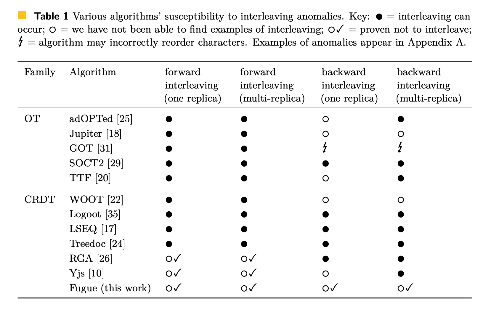
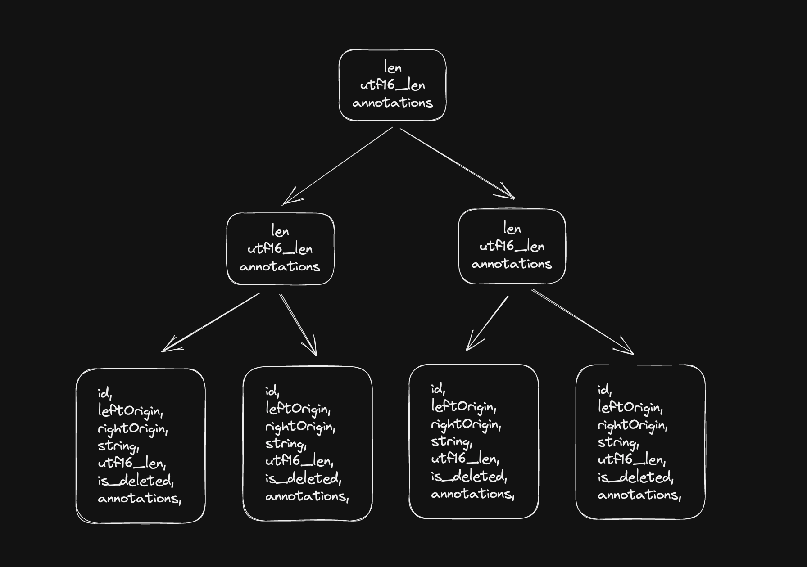
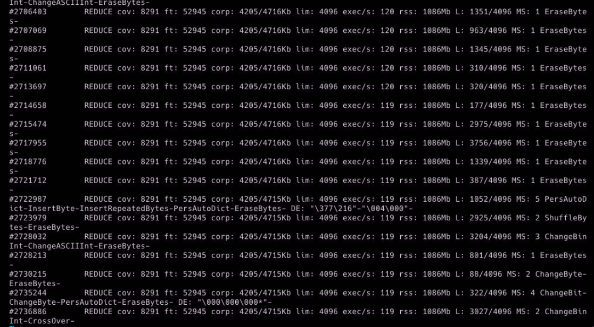

# [crdt-richtext](https://github.com/loro-dev/crdt-richtext): Peritext 和 Fugue 的 Rust 实现

import Authors, { Author } from "../../../components/authors";

<Authors date="2023-04-20">
  <Author
    name="Zixuan Chen"
    link="https://twitter.com/https://twitter.com/zx_loro"
  />
</Authors>

介绍一个新的 Rust crate，它结合了 [Peritext](https://inkandswitch.com/peritext) 和 [Fugue](https://arxiv.org/abs/2305.00583) 的强大功能以及令人印象深刻的性能，专为富文本量身定制。该 crate 的功能将被整合到 **[Loro](https://www.loro.dev/)** 中，这是一个正在开发的通用 CRDT 库。

# 什么是 Peritext

[Peritext: A CRDT for Rich-Text Collaboration](https://inkandswitch.com/peritext)

Peritext 是一种新颖的富文本 CRDT（无冲突复制数据类型）算法。它能够在富文本格式中合并并发编辑，同时[尽可能保留用户的意图](https://www.inkandswitch.com/peritext/#preserving-the-authors-intent)。其主要关注点是合并富文本内容的格式和注释，例如粗体、斜体和评论。

> 💡 在并发富文本编辑的上下文中，用户意图的具体定义无法用几句话清楚地解释。最好通过具体的例子来理解。

Peritext 旨在解决几个重大挑战：

首先，它解决了由冲突的样式编辑引起的预期问题。例如，考虑一个文本示例，“The quick fox jumped.”。如果用户 A 将“The quick”突出显示为粗体，而用户 B 将“quick fox jumped”突出显示为粗体，则理想的合并结果应该是整个句子“The quick fox jumped.”都为粗体。然而，现有的算法可能无法满足这种期望，导致“The quick fox”或“The”和“jumped”变为粗体。

| 原始文本 | The quick fox jumped |
| --- | --- |
| 来自 A 的并发编辑 | **The quick** fox jumped |
| 来自 B 的并发编辑 | The **quick fox jumped** |
| 预期的合并结果 | **The quick fox jumped** |
| 直接合并 Markdown 文本的坏情况 | **The** quick **fox jumped** |
| Yjs 的坏情况 | **The quick** fox jumped |

此外，Peritext 管理样式和文本编辑之间的冲突。在同一个例子中，如果用户 A 将“The quick”突出显示为粗体，但用户 B 将文本更改为“The fast fox jumped.”，则理想的合并结果应该是“The fast”为粗体。

| 原始文本 | The quick fox jumped |
| --- | --- |
| 来自 A 的并发编辑 | **The quick** fox jumped |
| 来自 B 的并发编辑 | The fast fox jumped      |
| 预期的合并结果 | **The fast** fox jumped  |

更重要的是，Peritext 考虑了对扩展样式的不同期望。例如，如果你在粗体文本后键入，你通常希望新文本继续为粗体。但是，如果你在超链接或评论后键入，你可能不希望新的输入成为超链接或评论的一部分。

# 什么是 Fugue

Fugue 是一种新的 CRDT 文本算法，在 [Matthew Weidner](https://arxiv.org/search/cs?searchtype=author&query=Weidner%2C+M) 等人的论文 *[The Art of the Fugue: Minimizing Interleaving in Collaborative Text Editing](https://arxiv.org/abs/2305.00583)* 中提出，很好地解决了**交错问题**。

## 交错问题

交错问题在 Martin Kleppmann 等人的论文 *[Interleaving anomalies in collaborative text editors](https://martin.kleppmann.com/2019/03/25/papoc-interleaving-anomalies.html)* 中提出。

交错的一个例子：

- A 从左到右/从右到左键入“Hello ”
- B 从左到右/从右到左键入“Hi ”
- 预期的结果：“Hello Hi ”或“Hi Hello ”
- 交错的结果可能看起来像：“HHeil lo”
  - 在 RGA 中从右到左键入时会发生这种情况。

 CRDT 处理文本内容时出现交错异常的示例。
来源：**Martin Kleppmann, Victor B. F. Gomes, Dominic P. Mulligan, and Alastair R. Beresford. 2019. Interleaving anomalies in collaborative text editors. [https://doi.org/10.1145/3301419.3323972](https://doi.org/10.1145/3301419.3323972)](./images/richtext0.png)

在使用[分数索引](https://madebyevan.com/algos/crdt-fractional-indexing/) CRDT 处理文本内容时出现交错异常的示例。
来源：\*\*Martin Kleppmann, Victor B. F. Gomes, Dominic P. Mulligan, and Alastair R. Beresford. 2019. Interleaving anomalies in collaborative text editors. [https://doi.org/10.1145/3301419.3323972](https://doi.org/10.1145/3301419.3323972)

[Fugue 论文](https://arxiv.org/abs/2305.00583)在表格中总结了交错问题的当前状态。



来源：Weidner, M., Gentle, J., & Kleppmann, M. (2023). The Art of the Fugue: Minimizing Interleaving in Collaborative Text Editing. _ArXiv_. /abs/2305.00583

当站点超过 2 个时，交错问题有时是无法解决的。有关详细说明，请参阅 [Fugue](https://arxiv.org/abs/2305.00583) 论文附录 B，定理 5 的证明。


交错问题无法解决的情况
来源：Weidner, M., Gentle, J., & Kleppmann, M. (2023). The Art of the Fugue: Minimizing Interleaving in Collaborative Text Editing. _ArXiv_. /abs/2305.00583

但是，我们仍然可以最大限度地减少交错的机会。Fugue 引入了**最大非交错**的概念，并用一种易于优化的优雅算法解决了它。*最大非交错*的定义对我来说很有意义，几乎没有歧义的余地。我不会在这里重申定义。但基本思想是首先通过 leftOrigin 解决前向交错。如果仍然存在歧义，则通过 rightOrigin 解决后向交错。（leftOrigin 和 rightOrigin 指的是插入字符时原始邻居的 id，就像 Yjs 一样）

# CRDT-Richtext

基于 Peritext 和 Fugue 的算法，我们制作了 `crdt-richtext`，这是一个用 Rust 编写的库，提供 wasm 接口。它现在可以在 [crates.io](http://crates.io) 和 npm 上使用。

## 示例

```tsx
import { RichText } from "crdt-richtext-wasm";

const text = new RichText(BigInt(1));
text.insert(0, "你好，世界！");
text.insert(2, "呀");
expect(text.toString()).toBe("你好呀，世界！");
text.annotate(0, 3, "bold", AnnotateType.BoldLike);
const spans = text.getAnnSpans();
expect(spans.length).toBe(2);
expect(spans[0].text).toBe("你好呀");
expect(spans[0].annotations.size).toBe(1);
expect(spans[0].annotations.has("bold")).toBeTruthy();
expect(spans[1].text.length).toBe(4);

const b = new RichText(BigInt(2));
b.import(text.export(new Uint8Array()));
expect(b.toString()).toBe("你好呀，世界！");
```

## 数据结构

我们大量使用 B-Tree 来优化我们的算法。我们制作了一个名为 [generic-btree](https://github.com/loro-dev/generic-btree) 的库，它是用安全的 Rust 代码编写的，为我们的优化工作提供了灵活的基础。

[https://github.com/loro-dev/generic-btree](https://github.com/loro-dev/generic-btree)



B-Tree 内部的缓存内容

在文本 CRDT 中，我们需要解决几个常见的任务，包括：

- 在给定索引处查找、插入或删除内容：
  - 我们使用 BTree 来查找和更新内容
  - 时间复杂度为 O(logN)，其中 N 是内容的长度
- 查找具有给定操作 ID 的内容：
  - 我们使用 HashMap 和 BTree 的组合
  - 时间复杂度为 O(logN)，其中 N 是操作数
- 压缩内存中的内容：
  - 为了减少以原始格式存储每个操作所使用的内存量，我们使用 Yjs 和 DiamondTypes 的 RLE 技巧来压缩内容。
    - 这种压缩背后的见解是，相邻的插入和删除往往是连续的，因此我们可以合并它们并存储更少的元数据。
  - 通常，图中的每个叶节点都包含十几个字符
- 在 UTF-16 和 UTF-8 之间转换索引：
  - 在 JS 中，字符串的默认编码是 utf16，但在 Rust 中，默认编码是 utf8。虽然 WASM 接口可以帮助我们转换字符串的编码，但我们仍然需要转换操作的*索引*。
  - 为了解决这个问题，`crdt-richtext` 还在 B-Tree 中存储了内容的 UTF-16 长度。因此，我们可以使用 utf8 索引或 utf16 索引来查询 B-Tree。
- 存储样式/格式/评论的边界：
  - 我们使用相同的 B-Tree 来存储边界，每个子树对应一个文本或逻辑删除的范围。对于树中的每个节点，我们存储哪些注释在其之前开始、在其之后开始、在其之前结束或在其之后结束。
    ```rust
    #[derive(Debug, PartialEq, Eq, Default, Clone)]
    pub struct ElemAnchorSet {
        start_before: FxHashSet<AnnIdx>,
        end_before: FxHashSet<AnnIdx>,
        start_after: FxHashSet<AnnIdx>,
        end_after: FxHashSet<AnnIdx>,
    }
    ```
  - 这基本上与 Peritext 的优化相同，只是我们在树上进行。

## 编码

我们使用列式编码，这是 Martin Kelppmann [在 automerge 中](https://github.com/automerge/automerge-classic/pull/253) 首次应用于 CRDT 的。为了在 Rust 中更容易实现，我们创建了 [Serde Columnar: Ergonomic columnar storage encoding crate](https://www.notion.so/Serde-Columnar-Ergonomic-columnar-storage-encoding-crate-7b0c86d6f8d24e4da45a1e2ebd86741c?pvs=21) 库。

## 通过 libFuzzer 进行大量测试

测试驱动开发 (TDD) 提供了惊人的开发体验。如果可能，我总是在继续之前为独立模块编写单元测试。然而，对于像 CRDT 这样的算法，手动列出所有可能的情况是不可行的，但自动生成测试用例很容易。这就是模糊测试发挥作用的地方。

一些模糊器可以跟踪覆盖率信息并对输入数据生成突变以最大化代码覆盖率。LibFuzzer 还可以识别内存泄漏和 UAF 问题。

`[cargo-fuzz`](https://www.notion.so/crdt-richtext-Rust-implementation-of-Peritext-and-Fugue-c49ef2a411c0404196170ac8daf066c0?pvs=21) 为编写模糊测试提供了用户友好的 API，它支持两个模糊器：libFuzzer 和 AFL。它使非结构化的 libFuzzer 感觉结构化。因此，我们能够以这种方式编写模糊测试

```rust
use arbitrary::Arbitrary;

#[derive(Arbitrary, Clone, Debug, Copy)]
pub enum Action {
    Insert {
        actor: u8,
        pos: u8,
        content: u16,
    },
    Delete {
        actor: u8,
        pos: u8,
        len: u8,
    },
    Annotate {
        actor: u8,
        pos: u8,
        len: u8,
        annotation: AnnotationType,
    },
    Sync(u8, u8),
}

pub fn fuzzing(actions: Vec<Action>) {
	// run tests based on actions
	...
}

#![no_main]
use libfuzzer_sys::fuzz_target;

fuzz_target!(|actions: [Action; 100]| { fuzzing(actions.to_vec()) });
```



我们将在进行重大更改后运行数百万次模糊测试。模糊器可以帮助我们提取最有用的数千个测试以包含到语料库中。可以通过运行语料库来验证微小的更改。

我们也在 Loro 的 CRDT 中使用模糊测试。当我们对代码进行重大调整时，这个测试套件就像我们的安全网。它非常擅长发现我们所有的小失误。

# 性能

## 基准测试

- 基准测试设置
  ### **B4: 真实世界的编辑数据集**
  重放一个真实世界的编辑数据集。该数据集包含一个大型文本文档的逐字符编辑轨迹，该论文的 LaTeX 来源：[https://arxiv.org/abs/1608.03960(在新标签页中打开)](https://arxiv.org/abs/1608.03960)
  来源：[https://github.com/automerge/automerge-perf/tree/master/edit-by-index(在新标签页中打开)](https://github.com/automerge/automerge-perf/tree/master/edit-by-index)
  - 182,315 次单字符插入操作
  - 77,463 次单字符删除操作
  - 总共 259,778 次操作
  - 最终文档中有 104,852 个字符
    我们模拟一个客户端重放所有更改并存储每次更新。我们测量重放更改的时间和所有更新消息的大小 (`updateSize`)、任务执行后编码文档的大小 (`docSize`)、编码文档的时间 (`encodeTime`)、解析编码文档的时间 (`parseTime`) 以及用于在内存中保存解码文档的内存 (`memUsed`)。
  ### **[B4 x 100] 真实世界的编辑数据集 100 次**
  重放 [B4] 数据集一百次。最终文档的大小超过 1000 万个字符。作为比较，《权力的游戏：冰与火之歌》一书只有 160 万个字符长（包括空格）。
  - 18,231,500 次单字符插入操作
  - 7,746,300 次单字符删除操作
  - 总共 25,977,800 次操作
  - 最终文档中有 10,485,200 个字符

基准测试于 2023-05-11 在 2020 M1 MacBook Pro 13 英寸上进行。

| N=6000 | crdt-richtext-wasm | loro-wasm | automerge-wasm | tree-fugue | yjs | ywasm |
| --- | --- | --- | --- | --- | --- | --- |
| [B4] 应用真实世界的编辑数据集 (时间) | 176 +/- 10 ms | 141 +/- 15 ms | 821 +/- 7 ms | 721 +/- 15 ms | 1,114 +/- 33 ms | 23,419 +/- 102 ms |
| [B4] 应用真实世界的编辑数据集 (memUsed) | 跳过 | 跳过 | 跳过 | 2,373,909 +/- 13725 字节 | 3,480,708 +/- 168887 字节 | 跳过 |
| [B4] 应用真实世界的编辑数据集 (encodeTime) | 8 +/- 1 ms | 8 +/- 1 ms | 115 +/- 2 ms | 12 +/- 0 ms | 12 +/- 1 ms | 6 +/- 1 ms |
| [B4] 应用真实世界的编辑数据集 (docSize) | 127,639 +/- 0 字节 | 255,603 +/- 8 字节 | 129,093 +/- 0 字节 | 167,873 +/- 0 字节 | 159,929 +/- 0 字节 | 159,929 +/- 0 字节 |
| [B4] 应用真实世界的编辑数据集 (parseTime) | 11 +/- 0 ms | 2 +/- 0 ms | 620 +/- 5 ms | 8 +/- 0 ms | 43 +/- 3 ms | 40 +/- 3 ms |
| [B4x100] 应用真实世界的编辑数据集 100 次 (时间) | 15,324 +/- 3188 ms | 12,436 +/- 444 ms | 跳过 | 91,902 +/- 863 ms | 112,563 +/- 3861 ms | 跳过 |
| [B4x100] 应用真实世界的编辑数据集 100 次 (memUsed) | 跳过 | 跳过 | 跳过 | 224076566 +/- 2812359 字节 | 318807378 +/- 15737245 字节 | 跳过 |
| [B4x100] 应用真实世界的编辑数据集 100 次 (encodeTime) | 769 +/- 37 ms | 780 +/- 32 ms | 跳过 | 943 +/- 52 ms | 297 +/- 16 ms | 跳过 |
| [B4x100] 应用真实世界的编辑数据集 100 次 (docSize) | 12,667,753 +/- 0 字节 | 26,634,606 +/- 80 字节 | 跳过 | 17,844,936 +/- 0 字节 | 15,989,245 +/- 0 字节 | 跳过 |
| [B4x100] 应用真实世界的编辑数据集 100 次 (parseTime) | 1,252 +/- 14 ms | 170 +/- 15 ms | 跳过 | 368 +/- 13 ms | 1,335 +/- 238 ms | 跳过 |

完整的基准测试结果和代码可在 https://github.com/https://twitter.com/zx_loro/fugue-bench 获得。

值得注意的是：

- Automerge 的基准测试基于 `automerge-wasm`，它不是 Automerge 2.0 的最新版本。
- `crdt-richtext` 和 `fugue` 是专用 CRDT，它们往往更快，编码尺寸更小。
- `yjs`、`ywasm` 和 `loro-wasm` 的编码仍然包含可以显着压缩的冗余。有关更多详细信息，请参阅[完整报告](https://loro.dev/docs/performance/docsize)。
- loro-wasm 和 fugue 目前仅支持纯文本

# 讨论

[CRDT-richtext: Rust implementation of Peritext and Fugue | Hacker News](https://news.ycombinator.com/item?id=35988046)
