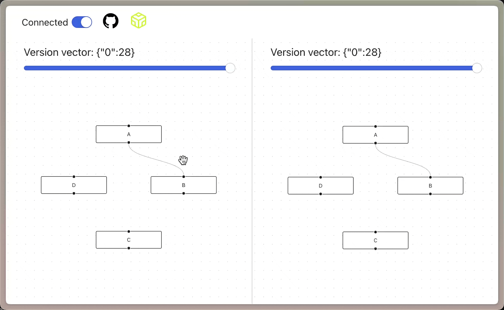
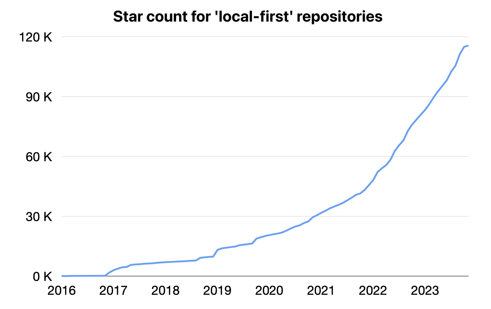
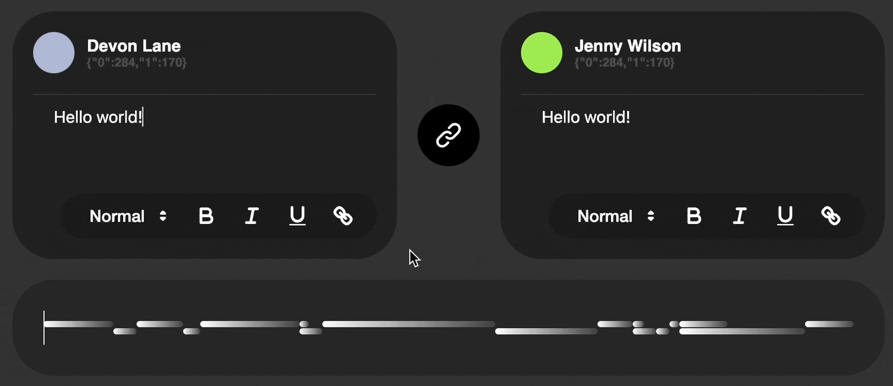
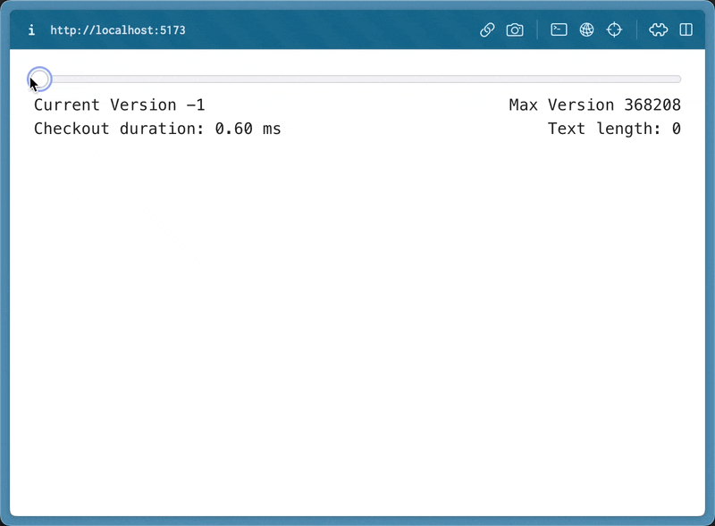

# Loro: 用 CRDTs 重新构想状态管理

import Caption from "../../components/caption";
import GitHub from "../../components/github";
import Authors, { Author } from "../../components/authors";

<Authors date="2023-11-13">
  <Author
    name="Zixuan Chen"
    link="https://twitter.com/https://twitter.com/zx_loro"
  />
  <Author name="Liang Zhao" link="https://github.com/leeeon233" />
</Authors>

<div>
  <div style={{ display: "inline" }}>
    我们的高性能 CRDTs 库 Loro 现已开源
  </div>
  <GitHub user="loro-dev" repo="loro" />
  <div style={{ display: "inline" }}>.</div>
</div>

在本文中，我们分享了我们对本地优先软件开发范式的愿景，解释了我们为什么对此感到兴奋，并讨论了 Loro 的现状。

有了更好的开发工具、文档和友好的生态系统，每个人都可以轻松构建本地优先的软件。



<Caption>
  您可以使用 Loro 轻松构建具有时间旅行功能的协作应用程序。
  [在线体验示例](https://loro-react-flow-example.vercel.app/)。
</Caption>

## 构想本地优先的开发范式

分布式状态在许多场景中都很常见，例如多人游戏、多设备文档同步和边缘网络。这些场景需要同步以实现一致性，通常需要精心的设计和编码。例如，需要考虑网络问题或并发写入操作。然而，对于广泛的应用程序，CRDTs 可以显着简化代码：

- CRDTs 可以自动合并并发写入而不会发生冲突。
- 更少的抽象。无需设计特定的后端数据库模式，手动执行预期的冲突合并，或实现内存到内存和内存到持久结构的转换接口。
- 开箱即用的离线支持

<details>
<summary>什么是 CRDTs</summary>

### 什么是无冲突复制数据类型 (CRDTs)？

CRDTs 是分布式系统中使用的允许在多个副本之间无冲突地合并更新的数据结构。在此上下文中，“副本”是指系统内不同的独立数据实例，例如不同用户设备上的同一协作文档。

CRDTs 使用户能够独立地在其副本上操作，例如编辑文档，而无需与其他副本进行实时通信。CRDTs 合并这些操作，确保所有副本都达到“强最终一致性”。只要所有节点都收到相同的更新集，无论顺序如何，它们的数据状态最终都将保持一致。

> 有关更多详细信息，请访问
> [什么是 CRDTs](https://www.loro.dev/docs/concepts/crdt)

</details>

<details>
<summary>什么时候不能使用 CRDTs</summary>
### 什么时候不能使用 CRDTs

CRDTs 只保证_强最终一致性_。您必须确保它适合您的应用程序。

“强最终一致性”：只要所有节点都收到相同的更新集，无论其顺序如何，它们的数据状态最终都将变得一致。

在需要立即一致性或事务完整性的场景中，强最终一致性可能不可接受，例如金融交易、独占资源访问或分配。

</details>

由于数据位于本地，客户端应用程序可以直接访问和操作本地数据，从而提供速度和可用性。此外，由于 CRDTs 的性质，可以在不依赖集中式服务器的情况下实现同步/实时协作（类似于 Git，允许在不丢失数据的情况下迁移到其他平台）。随着性能的提高，CRDTs 在各种情况下越来越多地取代传统的实时协作解决方案。

这代表了一种新的范式。本地优先不仅使用户能够控制自己的数据，而且使开发人员的生活更轻松。



<Caption>
  GitHub 中 *“本地优先”* 星标数的年增长率已达到 40% 以上。
</Caption>

### 将 CRDTs 与 UI 状态管理集成



<Caption>Loro 的富文本协作示例</Caption>

由于 CRDTs 支持无冲突的自动合并，因此管理分布式状态的挑战转移到了“如何在 CRDTs 上表达操作和状态”。

前端状态管理库通常要求开发人员定义如何检索状态并指定操作，如此处来自 Vue 的状态管理工具 Pinia 的示例所示：

```ts no-run
export const useCartStore = defineStore({
  id: "cart",
  state: () => ({
    rawItems: [] as string[],
  }),
  getters: {
    items: (state): Array<{ name: string; amount: number }> =>
      state.rawItems.reduce(
        (items, item) => {
          const existingItem = items.find((it) => it.name === item);

          if (!existingItem) {
            items.push({ name: item, amount: 1 });
          } else {
            existingItem.amount++;
          }

          return items;
        },
        [] as Array<{ name: string; amount: number }>,
      ),
  },
  actions: {
    addItem(name: string) {
      this.rawItems.push(name);
    },

    removeItem(name: string) {
      const i = this.rawItems.lastIndexOf(name);
      if (i > -1) this.rawItems.splice(i, 1);
    },

    async purchaseItems() {
      const user = useUserStore();
      if (!user.name) return;

      console.log("Purchasing", this.items);
      const n = this.items.length;
      this.rawItems = [];

      return n;
    },
  },
});
```

这种范式和 CRDTs 很容易兼容：状态管理库中的状态对应于 CRDT 类型，而 Action 对应于一组 CRDT 操作。

因此，通过 CRDTs 实现 UI 状态管理不需要用户改变他们的习惯。它还具有许多高级功能：

- 使状态自动同步/支持实时协作。
- 像 Git 一样，维护完整的分布式编辑历史。
- 它可以以低内存占用和紧凑的编码大小存储大量编辑历史。下面是一个例子。

有了这个，您可以轻松地实现具有实时/异步协作和时间机器功能的产品。



<Caption>
  <div style={{ display: "inline" }}>
    使用 Loro 对包含 360,000 多个操作的文档进行时间旅行。加载整个历史并回放，内存中仅占用 8.4MB。整个历史仅占用 361KB 的存储空间。编辑轨迹来自{" "}
  </div>
  <GitHub user="josephg" repo="editing-traces" />
  <div style={{ display: "inline" }}>.</div>
</Caption>

## Loro 简介

Loro 是我们的 CRDTs 库，现已在宽松许可下开源。我们相信，一个合作和友好的开源社区是创造出色开发人员体验的关键。

我们的目标是使 Loro 易于使用、可扩展并保持高性能。以下是 Loro 的最新状态。

### CRDTs

我们进行了广泛的探索，支持了一系列尚未广泛使用的 CRDT 算法。

#### 类 OT 的 CRDTs

> 更新：此算法现在称为 Event Graph Walker (Eg-Walker)

我们的 CRDTs 库建立在 Seph Gentle 的 [Diamond-types](https://github.com/josephg/diamond-types) 中出色的类 OT CRDTs 概念之上。Joseph Gentle 目前正在撰写一篇关于它的论文，值得期待。其显着特点包括降低本地操作的成本、更容易回收历史数据，以及有时更低的存储和内存开销。然而，它依赖于高性能算法来应用远程操作。这种设计具有巨大潜力，我们对其未来感到兴奋。

<details>
<summary>类 OT CRDT 算法简介</summary>

简要介绍类 OT CRDTs 的概念，这部分很复杂，需要一些先验知识。我可能无法很好地概括它。

类 OT CRDTs 的一般思想是，它们不保留 CRDTs 的数据结构（例如，originLeft originRight 信息）。在合并远程操作时，它们会返回到本地和远程的有向无环图历史中的最低共同祖先，并从那里重新应用每个操作。此过程重建 CRDTs 结构，解决并行编辑引起的冲突。其优点是，由于它不需要保留这些 CRDTs 元信息，本地操作几乎没有成本，就像 OT 一样，只需要保存插入和删除发生的索引。权衡是合并远程操作的时间更长，但这个问题可以通过精心设计的数据结构和算法得到显着缓解。此外，由于大多数并行编辑只持续很短的时间，最低共同祖先不远，使得合并过程很快。

下图显示了使用此算法在 DAG 上合并版本 2@1 和 1@2 的示例。该算法需要恢复到最低共同祖先版本 0@1，并从那里应用所有后续操作（总共四个操作）。为了更好地理解此图，请参阅 [https://www.loro.dev/docs/advanced/version_deep_dive](https://www.loro.dev/docs/advanced/version_deep_dive)


</details>

#### 富文本 CRDTs

今年 5 月，我们开源了 [crdt-richtext](https://github.com/loro-dev/crdt-richtext) 项目，集成了[富文本 CRDT](https://loro.dev/blog/loro-richtext) 和序列 CRDT [Fugue by Matthew Weidner](https://arxiv.org/abs/2305.00583) 的算法。当时我们的博客中对这两种算法进行了简要介绍 [our blog at the time](https://www.notion.so/crdt-richtext-Rust-implementation-of-Peritext-and-Fugue-c49ef2a411c0404196170ac8daf066c0?pvs=21)。

根据我们之前项目的经验，我们在当前的 Loro 中将富文本 CRDT 和 Fugue 集成到了我们的框架中。然而，最大的挑战是 [Peritext 与类 OT CRDTs 集成不佳](https://github.com/inkandswitch/peritext/issues/31)。我们最近克服了这个问题。我们开发了一种新的富文本 CRDT 算法，可以在类 OT CRDTs 上运行，并已通过 Peritext 论文中列出的富文本 CRDTs 标准的功能，在我们目前的百万次模糊测试中没有发现新问题。我们将来会写一篇文章专门介绍这个算法。

#### 可移动树

我们还支持了可移动树 CRDT。由于可能存在循环引用，同步树移动通常很复杂。在分布式环境中解决这个问题更具挑战性。

我们实现了 Martin Kleppmann 的论文，[_A Highly-Available Move Operation for Replicated Trees_](https://ieeexplore.ieee.org/document/9563274/)。该算法的思想是对所有移动操作进行排序，确保在所有副本中排序一致。然后，按顺序应用每个操作。如果一个操作会导致循环引用，它将无效。

我们发现它设计优雅且性能出色。本地操作的时间复杂度为 O(k)（k 为平均树深度，因为需要进行循环引用检测）。对于应用远程操作，这需要将新操作插入到排序列表中，我们必须撤销排序中后续的操作，应用远程操作，然后重做已撤销的操作，成本为 O(km)（m 为要撤销的操作数）。


<Caption>应用远程操作的可视化</Caption>

我们的测试表明，在一千个节点之间进行一万次随机移动的本地操作耗时不到 10 毫秒（在 M2 MAX 芯片上测试）。此外，该算法中合并远程操作的成本与在类 OT CRDTs 中应用远程操作的成本相似，使其具有可采用性。我们还在我们的 [movable-tree project](https://github.com/loro-dev/movable-tree) 中试验了 [log-spaced snapshots](https://madebyevan.com/algos/log-spaced-snapshots/) 和不可变数据结构方法，得出的结论是撤销+重做方法是最快且内存效率最高的方法。

### 数据结构

设计和试验数据结构是 Loro 开发过程中的常规工作。

我们之前开源了 [generic-btree](https://github.com/loro-dev/generic-btree)，并重新设计了其结构，以实现更紧凑的内存布局和缓存友好性。除了其卓越的性能外，其灵活性使我们能够以最少的代码支持文本所需的各种信息类型，如 utf16/Unicode 码点/utf8。我们还广泛地重用它来满足各种要求，突显了 Rust 令人印象深刻的类型表达能力。

在内部，我们[将文档的状态与其历史分离开来](https://www.loro.dev/docs/advanced/doc_state_and_oplog)。状态表示文档的当前形式，类似于 Git 的 HEAD 指针，而文档的历史类似于 Git 背后的完整操作历史。因此，多个文档状态可以对应于相同的历史。这种结构简化了我们的代码，并为将来支持版本控制提供了便利。

到目前为止，我们的大多数优化都集中在文本操作上，这在历史上是 CRDTs 中最棘手的问题之一。将来，我们计划针对更广泛的实际场景进行优化。

### 未来


我们的目标是在明年年中达到 1.0 版本，还有很多工作要完成。

鉴于我们的人力有限，我们将首先为 Web 开发人员提供一个 WASM 接口进行试验。优化 WASM 大小是我们此阶段的目标之一。我们的许多设计工作仍在进行中，我们计划在下个季度稳定下来，旨在提供一个简单但功能强大且灵活的 API。我们欢迎在我们的[社区讨论](https://discord.gg/tUsBSVfqzf)中提出想法和建议。

还有大量的文档工作要做，以使使用 Loro 的过程变得愉快。一个潜在的成功指标是 GPT 根据我们的文档生成足够好的代码。

为开发人员开发工具是一项具有挑战性且令人兴奋的任务。前端开发中的许多开发人员工具和可视化方法都非常出色，我们希望将这种体验带入 CRDTs 和本地优先开发的世界。DevTools 将揭示 CRDTs 的隐藏状态并简化控制，使状态维护和调试变得轻而易举。

我们还计划支持更丰富的 CRDT 语义，包括可移动列表和全局撤销/重做操作，以支持更多样化的应用场景。

## 寻求合作项目机会

我们的设计和优化工作需要来自实际应用的反馈。如果您对本地优先的未来感到兴奋，并认为 Loro 可以帮助您，请直接通过 [zx@loro.dev](mailto:zx@loro.dev) 与我们联系。我们对合作持开放态度，并随时准备提供帮助。
