# Loro 富文本 CRDT 简介

import Authors, { Author } from "../../components/authors";

<Authors date="2024-01-22">
  <Author
    name="Zixuan Chen"
    link="https://twitter.com/https://twitter.com/zx_loro"
  />
</Authors>

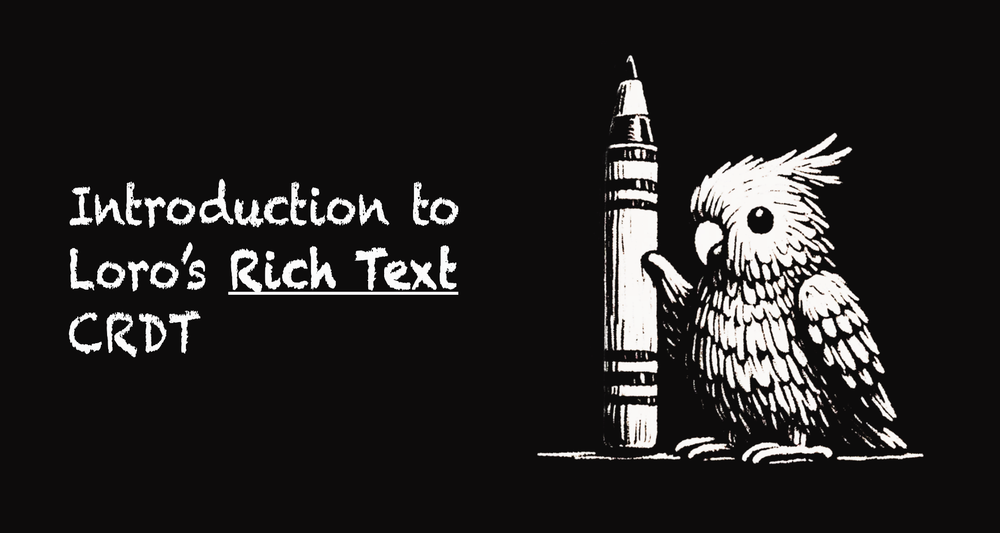

import Caption from "../../components/caption";
import Demo from "@components/richtextDemo";

本文介绍了 Loro 中实现的富文本 CRDT 算法，该算法符合 [Peritext] 的无缝富文本协作标准。此外，它可以构建在任何列表 CRDT 算法之上，并将它们转化为富文本 CRDT。

<div className="mt-6" />
<Demo />
<Caption>
  以上是 Loro 富文本 CRDT 的在线演示，使用 Quill 构建。重播后，您可以模拟实时协作和离线时的并发编辑。您还可以在历史视图上拖动以重播编辑历史。
</Caption>

如果您对 CRDT 不熟悉，我们的文章[什么是 CRDT](/docs/concepts/crdt) 提供了简要介绍。

## 背景

Loro 基于 Joseph Gentle 提出的 [Event Graph Walker (Eg-walker)](/docs/advanced/replayable_event_graph) 算法，但该算法无法集成 Peritext 的原始版本。这促使我们创建一种新的富文本算法。它独立于特定的列表 CRDT，因此可以很好地与 Eg-walker 配合使用，并在其之上开发以建立富文本 CRDT。

在深入研究 Loro 富文本 CRDT 的算法之前，我想简要介绍一下 Eg-walker 和 Peritext，以及为什么 Peritext 不能在 Eg-walker 上使用。

<details>
<summary>列表 CRDT 回顾</summary>

### 列表 CRDT 回顾

与 OT 不同，大多数面向列表的 CRDT 为每个项目或字符分配一个唯一的 ID，通常对应于其插入操作的操作 ID。通过为每个字符提供唯一的 ID，我们可以通过其 ID 可靠地引用字符或位置。

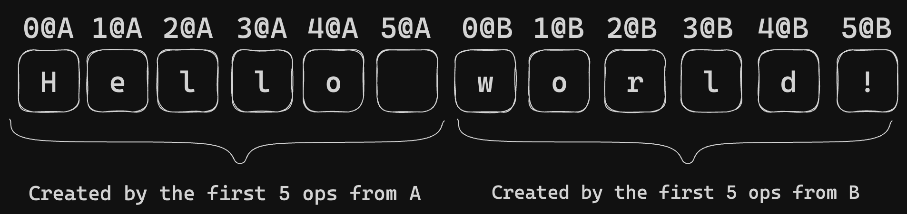

唯一的 ID 消除了同步期间对一致位置描述的担忧。例如，通过指定被删除字符的 ID，删除操作变得很简单，而插入操作则使用相邻字符的 ID 来描述。在同一位置并发插入的情况下，列表 CRDT 算法可以解决一致性问题。

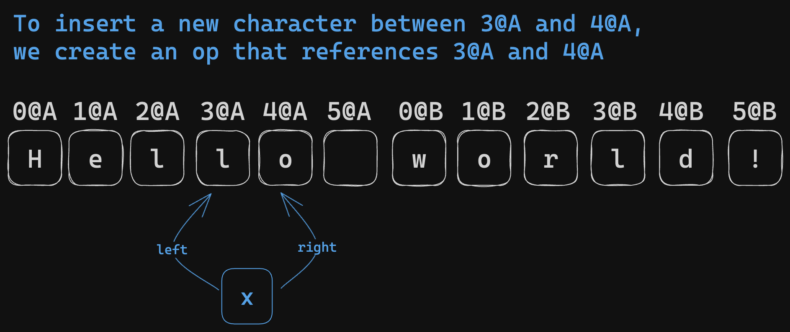

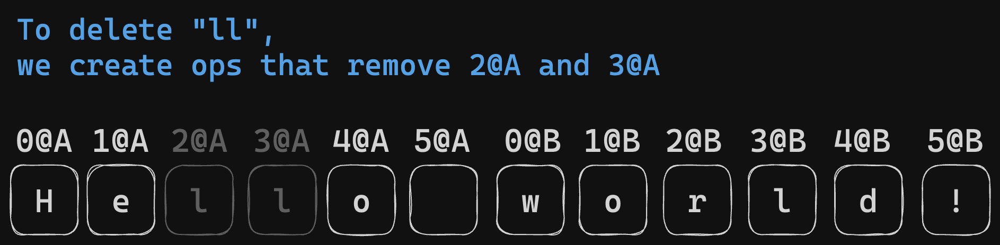

然而，列表 CRDT 的一个显着限制是使用“墓碑”。删除字符后，它不会被完全移除，而是被一个墓碑替换，以保持 ID 的位置。根据算法，一旦所有参与节点都确认了删除，这个墓碑就可能被移除。然而，确定所有对等方是否都收到了相应的删除操作可能具有挑战性。此信息通常意味着许多 CRDT 的额外开销。因此，最简单的解决方案是不执行任何墓碑收集。

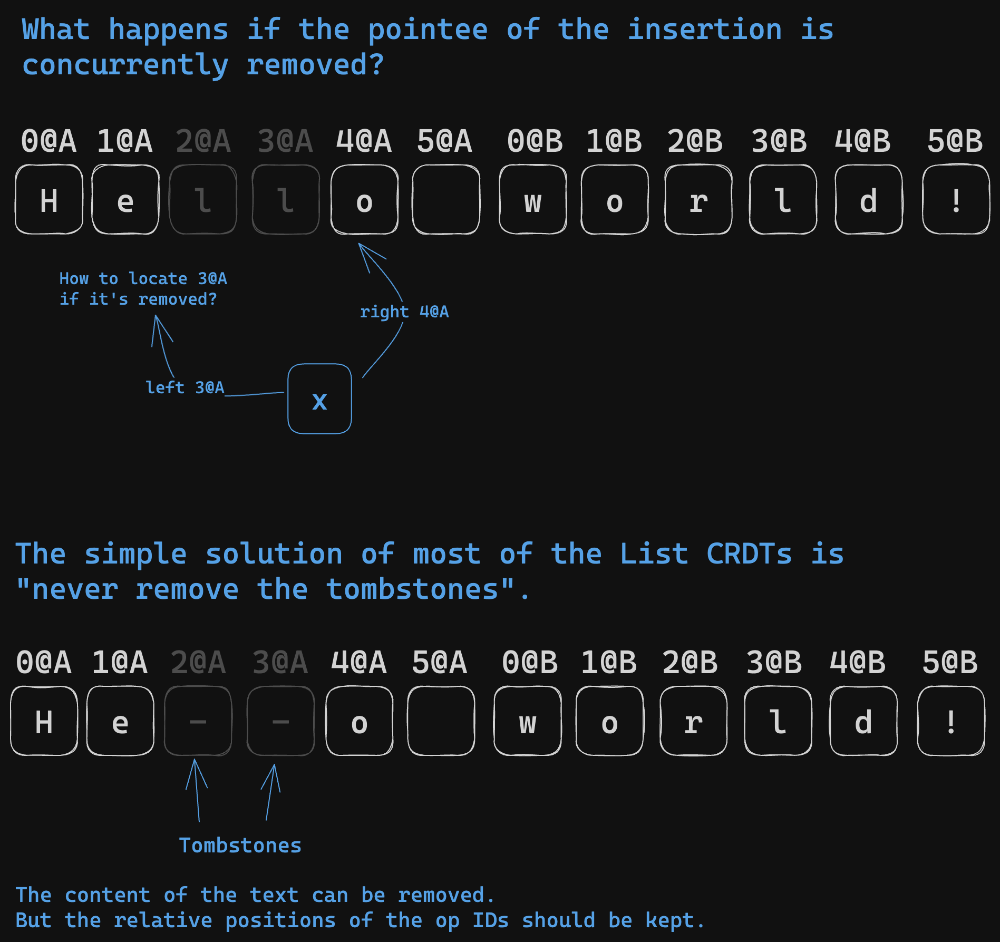

</details>

### Event Graph Walker 简介

Eg-walker 是一种新颖的 CRDT 算法，在以下文章中介绍：

> [Collaborative Text Editing with Eg-walker: Better, Faster, Smaller](https://arxiv.org/abs/2409.14252)
> 作者：Joseph Gentle, Martin Kleppmann

Eg-walker 是一种新颖的 CRDT 算法，它结合了 OT 和 CRDT 的优点。它具有 CRDT 的分布式特性，可实现 P2P 协作和数据所有权。此外，它在没有并发编辑的场景中实现了最小的开销，类似于 OT。

import { ReactPlayer } from "../../components/video";

<ReactPlayer
  url="/static/REG.mp4"
  width={"100%"}
  muted={true}
  loop={true}
  controls={true}
  playing={true}
/>

无论是在实时协作还是多端同步中，这些并行编辑的历史都会形成一个有向无环图 (DAG)，类似于 Git 的历史。Eg-walker 算法在 DAG 上记录用户编辑的历史。

与传统的 CRDT 不同，Eg-walker 只记录操作的原始描述，而不记录 CRDT 的元数据。例如，在文本编辑场景中，[RGA 算法] 需要左侧字符的操作 ID 和 [Lamport 时间戳][Lamport] 来确定插入点。[Yjs]/Fugue 则需要插入时左右字符的操作 ID。相比之下，Eg-walker 通过只记录插入时的索引来简化了这一点。Loro 在 Eg-walker 之上使用了 [Fugue]，继承了这些优点。

索引不是一个稳定的位置描述符，因为操作的索引会受到其他操作的影响。例如，如果您高亮显示从 `index=x` 到 `index=y` 的内容，而同时有人在 `index=n` 处插入 n 个字符，其中 `n<x`，那么您的高亮范围应该移动到从 `x+n` 到 `y+n`。但是 Eg-walker可以通过重播历史来确定此索引的确切位置。因此，它可以通过重播历史来重建相应的 CRDT 结构。

重建历史似乎很耗时，但 Eg-walker 只需要回溯一部分。在合并来自远程源的更新时，它只需要重播与远程更新并行的操作，重建本地 CRDT 以计算将远程操作应用于当前文档后的差异。

Eg-walker 算法以其快速的本地更新速度而著称，并且消除了对 CRDT 中墓碑收集的担忧。例如，如果一个操作已在所有端点之间同步，则不会有新的操作与其并发发生，从而可以安全地将其从历史中移除。

<details>
<summary>什么是 Fugue</summary>

Fugue 是一种新的 CRDT 文本算法，在 Matthew Weidner 等人的论文 *[The Art of the Fugue: Minimizing Interleaving in Collaborative Text Editing](https://arxiv.org/abs/2305.00583)* 中提出，它很好地解决了**交错问题**。

交错问题在 Martin Kleppmann 等人的论文 *[Interleaving anomalies in collaborative text editors](https://martin.kleppmann.com/2019/03/25/papoc-interleaving-anomalies.html)* 中提出。

交错的一个例子：

- A 从左到右/从右到左键入“Hello ”
- B 从左到右/从右到左键入“Hi ”
- 预期的结果：“Hello Hi ”或“Hi Hello ”
- 交错的结果可能看起来像：“HHeil lo”
  - 在 RGA 中从右到左键入时会发生这种情况。

 CRDT 处理文本内容时出现交错异常的示例。
来源：**Martin Kleppmann, Victor B. F. Gomes, Dominic P. Mulligan, and Alastair R. Beresford. 2019. Interleaving anomalies in collaborative text editors. [https://doi.org/10.1145/3301419.3323972](https://doi.org/10.1145/3301419.3323972)](./images/richtext0.png)

在使用[分数索引](https://madebyevan.com/algos/crdt-fractional-indexing/) CRDT 处理文本内容时出现交错异常的示例。来源：\*\*Martin Kleppmann, Victor B. F. Gomes, Dominic P. Mulligan, and Alastair R. Beresford. 2019. Interleaving anomalies in collaborative text editors. [https://doi.org/10.1145/3301419.3323972](https://doi.org/10.1145/3301419.3323972)

[Fugue 论文](https://arxiv.org/abs/2305.00583)在表格中总结了交错问题的当前状态。


来源：Weidner, M., Gentle, J., & Kleppmann, M. (2023). The Art of the Fugue: Minimizing Interleaving in Collaborative Text Editing. _ArXiv_. /abs/2305.00583

当站点超过 2 个时，交错问题有时是无法解决的。有关详细说明，请参阅 [Fugue](https://arxiv.org/abs/2305.00583) 论文附录 B，定理 5 的证明。


交错问题无法解决的情况 来源：Weidner, M., Gentle, J., & Kleppmann, M. (2023). The Art of the Fugue: Minimizing Interleaving in Collaborative Text Editing. _ArXiv_. /abs/2305.00583

但是，我们仍然可以最大限度地减少交错的机会。Fugue 引入了**最大非交错**的概念，并用一种易于优化的优雅算法解决了它。*最大非交错*的定义对我来说很有意义，几乎没有歧义的余地。我不会在这里重申定义。但基本思想是首先通过 leftOrigin 解决前向交错。如果仍然存在歧义，则通过 rightOrigin 解决后向交错。（leftOrigin 和 rightOrigin 指的是插入字符时原始邻居的 id，就像 Yjs 一样）

</details>

### Peritext 简介

[Peritext] 由 _Geoffrey Litt 等人_ 提出。这是第一篇讨论富文本 CRDT 的论文。它可以在富文本格式中合并并发编辑，同时[尽可能保留用户的意图](https://www.inkandswitch.com/peritext/#preserving-the-authors-intent)。其主要关注点是合并富文本内容的格式和注释，例如粗体、斜体和评论。它在 [Automerge] 和 [crdt-richtext] 中实现。

> 💡 在并发富文本编辑的上下文中，用户意图的具体定义无法用几句话清楚地解释。最好通过具体的例子来理解。

Peritext 旨在解决几个重大挑战：

首先，它解决了由冲突的样式编辑引起的预期问题。例如，考虑一个文本示例，“The quick fox jumped.”。如果用户 A 将“The quick”突出显示为粗体，而用户 B 将“quick fox jumped”突出显示为粗体，则理想的合并结果应该是整个句子“The quick fox jumped.”都为粗体。然而，现有的算法可能无法满足这种期望，导致“The quick fox”或“The”和“jumped”变为粗体。

| 原始文本 | The quick fox jumped |
| --- | --- |
| 来自 A 的并发编辑 | **The quick** fox jumped |
| 来自 B 的并发编辑 | The **quick fox jumped** |
| 预期的合并结果 | **The quick fox jumped** |
| 直接合并 Markdown 文本的坏情况 | **The** quick **fox jumped** |
| Yjs 的坏情况 | **The quick** fox jumped |

此外，Peritext 管理样式和文本编辑之间的冲突。在同一个例子中，如果用户 A 将“The quick”突出显示为粗体，但用户 B 将文本更改为“The fast fox jumped.”，则理想的合并结果应该是“The fast”为粗体。

| 原始文本 | The quick fox jumped |
| --- | --- |
| 来自 A 的并发编辑 | **The quick** fox jumped |
| 来自 B 的并发编辑 | The fast fox jumped |
| 预期的合并结果 | **The fast** fox jumped |

更重要的是，Peritext 考虑了对扩展样式的不同期望。例如，如果你在粗体文本后键入，你通常希望新文本继续为粗体。但是，如果你在超链接或评论后键入，你可能不希望新的输入成为超链接或评论的一部分。

<div style={{filter: "invert(1) hue-rotate(180deg)"}}>
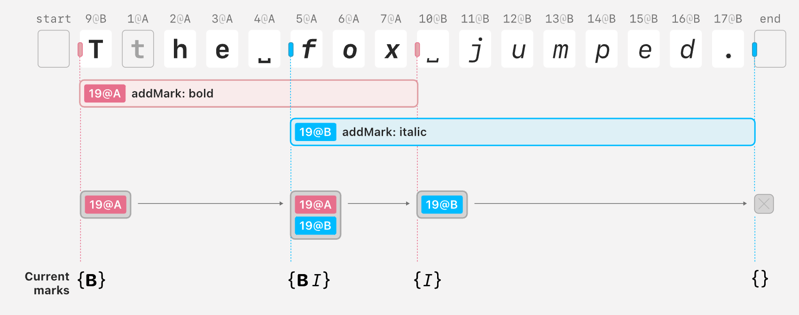
</div>
<Caption>
Peritext 内部状态的插图。它使用字符操作的 ID 来记录样式范围。在示例中，粗体标记的范围是 `{ start: { type: "before", opId: "9@B" }, end: { type: "before", opId: "10@B" }}`
</Caption>

### 为什么原始 Peritext 不能直接与 Eg-walker 一起使用

一方面，Peritext 的算法通过字符 OpID [表达样式范围](https://www.inkandswitch.com/peritext/#generating-inline-formatting-operations)。如果不重播历史，基于 Eg-walker 的 CRDT 无法确定与这些 OpID 对应的具体位置。

另一方面，通过重播在 Eg-walker 上建模 Peritext是不可行的。这是因为 Eg-walker 的“本地回溯就足够了”依赖于算法满足“相同的操作将产生相同的效果，无论当前状态如何”，而 Peritext 不遵守这一点。例如，在位置 `p` 插入字符“x”时，“x”是否为粗体取决于“`p` 是否被粗体包围”和“[ `p` 处的墓碑是否包含粗体和其他样式的边界](https://arc.net/l/quote/ifxpaand)”。

## Loro 的富文本 CRDT

### 算法

Loro 使用称为“样式锚点”的特殊控制字符来实现富文本。每个匹配的开始锚点和结束锚点对都包含以下信息：

- 样式操作的操作 ID
- 样式的键值对
- 样式的 [Lamport 时间戳][Lamport]
- 样式扩展行为：确定在样式边界之前或之后插入的新文本是否应继承该样式。

确定字符样式的方法如下：

- 找到包含该字符的所有样式锚点对，其中每对都由相同的样式操作创建
- 根据键聚合对。可能存在具有相同键但不同值的多个样式对。在这种情况下，选择具有最大 Lamport 时间戳的值（如果 Lamport 时间戳相等，则使用 peer ID 来打破平局）

与 [Yjs 使用控制字符的方法](https://www.inkandswitch.com/peritext/#adding-control-characters-to-plain-text) 来处理富文本相反，我们的算法在它们源自相同的样式操作时将开始和结束锚点配对。这种方法可以准确地处理以下情况：

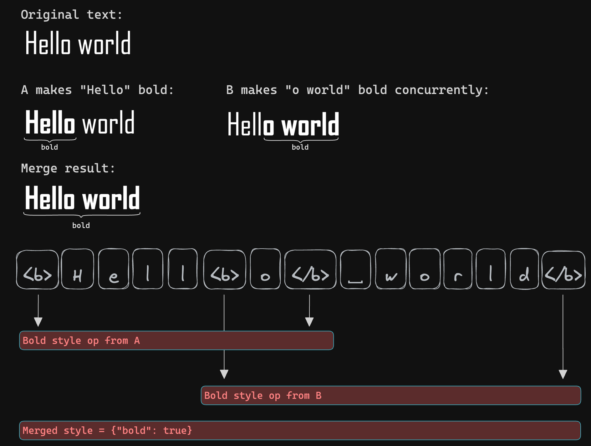

这些特殊的控制字符不向用户公开；从用户的角度来看，每个控制字符的长度实际上为零。我们的数据结构支持各种测量文本长度以索引文本内容的方法。除了 Unicode、UTF-16 和 UTF-8，我们还以 `实体长度` 来测量富文本长度。它将每个样式锚点视为长度为 1 的实体，并以 Unicode 长度测量纯文本。

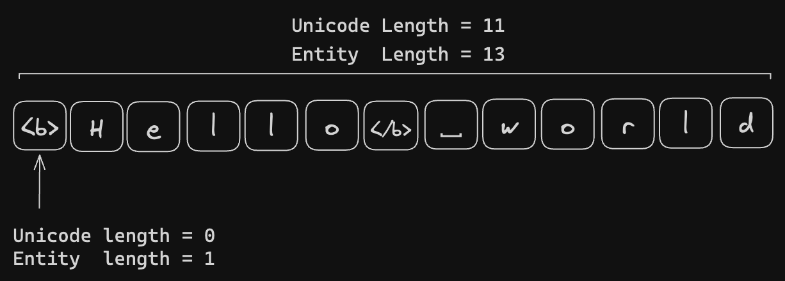

| 概念 | 定义 |
| --- | --- |
| 样式锚点 | 在 Loro 中使用的控制字符，表示样式边界的开始和结束。它们被区分为开始和结束锚点，分别表示样式的开始和结束。 |
| 富文本元素 | 富文本元素是文本范围或样式锚点。富文本元素的列表表示 Loro 富文本的内部状态。 |
| Unicode 索引 | 一种在富文本中索引文本位置的方法。在这种方法中，文本的长度以 Unicode 字符长度测量，样式锚点的长度被认为是 0。 |
| 实体索引 | 一种在富文本中索引文本位置的方法。在这种方法中，文本的长度以 Unicode 字符长度测量，样式锚点的长度被认为是 1。 |

#### 本地行为

当用户在特定的 Unicode 索引处插入文本时，可能存在多个有效的插入点。这是由于样式锚点造成的，从用户的角度来看，它们是零长度元素。

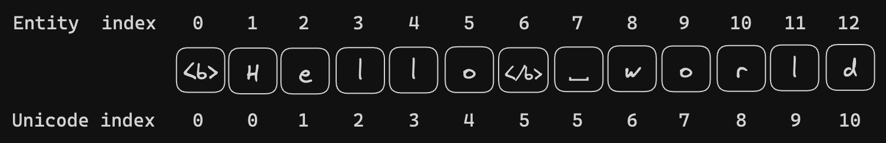

例如，在 `<b>Hello</b> world` 的情况下，当用户在 Unicode `index=5` 处插入内容时，他们面临着在 `</b>` 的左侧或右侧插入的选择。如果用户将粗体的扩展行为设置为向前扩展，则新字符将插入到 `</b>` 的左侧，使插入的文本也变为粗体。

当用户删除文本时，Loro 使用一个额外的映射层来避免删除文本范围内的样式锚点。

为了对样式的删除进行建模，会添加一个新的值为 null 的样式锚点对。

我们可以实现以下优化来移除冗余的样式锚点：

- 不包含任何文本的样式锚点可以被移除。
- 当样式完全相互抵消时，例如一个粗体范围被一个非粗体范围取消，我们可以移除它们的样式锚点。

所有这些行为都发生在本地，并且算法独立于特定的列表 CRDT。

##### 在样式边界插入文本时的行为

大多数现代富文本编辑器（Google Doc、Microsoft Word、Notion）的行为如下：当在粗体文本后立即输入新文本时，新文本应继承粗体样式；当在超链接后输入时，新内容不应继承超链接样式。不同的样式对文本插入位置有不同的偏好，这可能导致潜在的冲突。这反映在插入新文本时我们拥有的自由度上。

用户根据基于文本的索引（如 Unicode 索引）与富文本进行交互。由于样式锚点的 Unicode 长度为 0，具有 n 个样式锚点的 Unicode 索引会呈现 n + 1 个潜在的插入位置。

我们根据以下规则选择插入位置：

1. 插入发生在不应向后扩展的样式的开始锚点之前。
2. 插入发生在表示粗体类标记结束的样式锚点之前（expand = "after" or expand = "both"）。
3. 插入发生在表示链接类标记结束的样式锚点之后（expand = "none" or expand = "before"）。

规则 1 应优先于规则 2 和 3，以防止[意外创建新样式](https://github.com/inkandswitch/peritext/issues/32)。

当前的方法首先向前扫描以找到满足规则 1 和 2 的最后一个位置。

然后，它向后扫描以找到满足规则 3 的第一个位置。

#### 合并远程更新

Loro 将样式锚点视为特殊元素，并使用相同的列表 CRDT 来处理它们，以解决并发冲突。与富文本相关的逻辑独立于特定的列表 CRDT。因此，该算法可以依赖任何列表 CRDT 算法来合并远程操作。Loro 使用 [Fugue] 列表 CRDT 算法。

当远程更新插入新的样式锚点时，会添加新的样式；如果删除了旧的样式锚点，则会移除相应的旧样式。

#### 强最终一致性

该算法的内部状态由一个元素列表组成，每个元素要么是文本段，要么是样式锚点。富文本文档是从这个内部状态派生出来的。

内部状态通过上游列表 CRDT 实现强最终一致性。

相同的内部状态会产生相同的富文本文档。因此，同一组更新将产生相同的富文本文档，这证明了该算法的强最终一致性。

### Peritext 中的标准

[Peritext 论文](https://www.inkandswitch.com/peritext/static/cscw-publication.pdf) 指定了富文本内联格式的意图保留合并行为。Loro 的富文本算法成功通过了其中概述的所有测试用例。

#### 1. 并发格式化和插入

| 名称 | 文本 |
| :--- | :--- |
| 原始 | Hello World |
| 并发 A | **Hello World** |
| 并发 B | Hello New World |
| 预期结果 | **Hello New World** |

Loro 通过将样式锚点与文本一起作为特殊元素处理，轻松支持此情况。

#### 2. 重叠格式化

| 名称 | 文本 |
| :--- | :--- |
| 原始 | Hello World |
| 并发 A | **Hello** World |
| 并发 B | Hel**lo World** |
| 预期结果 | **Hello World** |

此情况已在前面分析过。由于我们的样式锚点包含样式操作 ID 信息，我们知道有两个粗体段：一个从 0 到 5，另一个从 3 到 11，从而允许我们合并它们。

| 名称 | 文本 |
| :--- | :--- |
| 原始 | Hello World |
| 并发 A | **Hello** World |
| 并发 B | Hel*lo World* |
| 预期结果 | **Hel*lo*** _World_ |

轻松支持多种样式类型。

| 名称 | 文本 | 注意 |
| :--- | :--- | :--- |
| 原始 | Hello World | |
| 并发 A | **Hello World** <br /> 然后 <br /> **Hello** World | 加粗，然后取消加粗 |
| 并发 B | Hello Wor**ld** | |
| 预期结果 | **Hello** Wor**ld** <br /> 或 <br /> **Hello** World | 两者都可接受 |

与 Peritext 一样，我们通过添加一个键为 `bold` 值为 `null` 的新样式来建模取消加粗。每个字符上每个样式键的最终值由包含该字符的具有最大 [Lamport] 时间戳的样式确定。因此，它轻松支持此情况。

#### 3. 在范围边界插入文本

在粗体样式后立即插入应导致新插入的文本也为粗体。

<div style={{ filter: "invert(1) hue-rotate(180deg)" }}>
  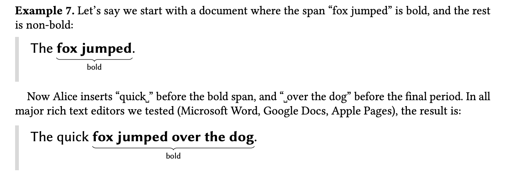
</div>

然而，在链接样式后立即插入应导致新插入的文本不具有超链接样式。

<div style={{ filter: "invert(1) hue-rotate(180deg)" }}>
  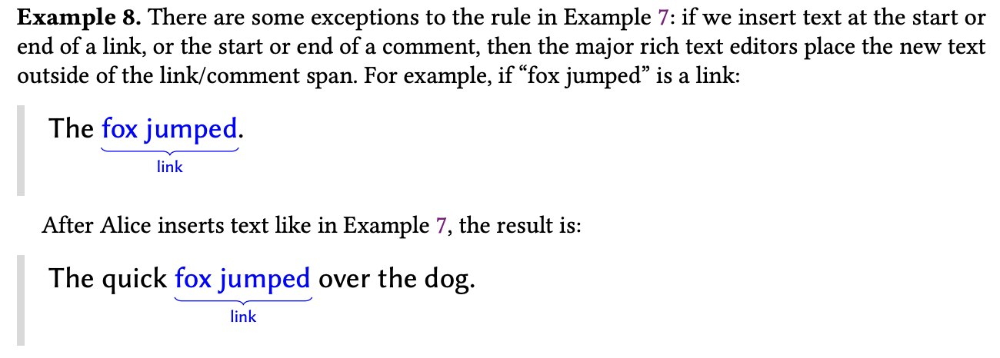
</div>

#### 4. 支持重叠的样式

<div style={{ filter: "invert(1)" }}>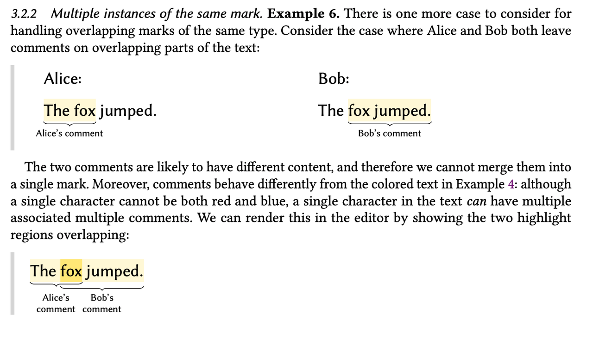</div>

重叠样式的问题与我们如何表示它们有关。

我们使用 [Quill 的 Delta](https://quilljs.com/docs/delta/) 格式来表示富文本。

```ts no_run
[
  { insert: "Gandalf", attributes: { bold: true } },
  { insert: " the " },
  { insert: "Grey", attributes: { color: "#cccccc" } },
];
```

<Caption>Quill Delta 格式的一个例子</Caption>

然而，它无法处理为同一键分配多个值的情况。因此，处理支持重叠的样式是一个令人头疼的问题。

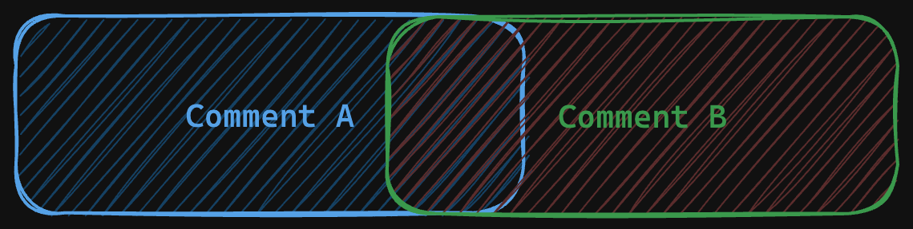

例如，在上面的情况下，文本“fox”同时被 Alice 和 Bob 评论。我们不能直接用 Quill 的 Delta 格式来表示它。因此，可能的解决方法包括：

**将属性值转换为列表**

```ts no-run
[
  { insert: "The ", attributes: { comment: [{ ...commentA }] } },
  {
    insert: "fox",
    attributes: { comment: [{ ...commentA }, { ...commentB }] },
  },
  { insert: " jumped", attributes: { comment: [{ ...commentB }] } },
];
```

**使用创建操作的操作 ID 作为属性的键**

```ts no-run
[
  { insert: "The ", attributes: { "id:0@A": { key: "comment", ...commentA } } },
  {
    insert: "fox",
    attributes: {
      "id:0@A": { key: "comment", ...commentA },
      "id:0@B": { key: "comment", ...commentB },
    },
  },
  {
    insert: " jumped",
    attributes: { "id:0@B": { key: "comment", ...commentA } },
  },
];
```

但这两种方法都需要 CRDT 库和应用程序代码的特殊行为，这处理起来很痛苦。

最后，我们发现表示可重叠样式的最佳方法是使用 `<key>:` 作为前缀，并允许用户分配唯一的后缀来创建不同的样式键。这种方法简化了 CRDT 库代码，因为它不需要处理特殊情况。它有效地解决了多个评论重叠的场景，并且对于应用程序编码也用户友好。

```ts no-run
[
  { insert: "The ", attributes: { "comment:alice": "Hi" } },
  {
    insert: "fox",
    attributes: { "comment:alice": "Hi", "comment:bob": "Jump" },
  },
  { insert: " jumped", attributes: { "comment:bob": "Jump" } },
];
```

以下是 Loro 中的示例代码：

```ts
const doc = new Loro();
doc.configTextStyle({
  comment: { expand: "none" },
});
const text = doc.getText("text");
text.insert(0, "The fox jumped.");
text.mark({ start: 0, end: 7 }, "comment:alice", "Hi");
text.mark({ start: 4, end: 14 }, "comment:bob", "Jump");
expect(text.toDelta()).toStrictEqual([
  {
    insert: "The ",
    attributes: { "comment:alice": "Hi" },
  },
  {
    insert: "fox",
    attributes: {
      "comment:alice": "Hi",
      "comment:bob": "Jump",
    },
  },
  {
    insert: " jumped",
    attributes: { "comment:bob": "Jump" },
  },
  {
    insert: ".",
  },
]);
```

## Loro 富文本算法的实现

以下是截至 2024 年 1 月 Loro 实现的概述。

### Loro 的架构

与 Event Graph Walker 的属性一致，Loro 使用 `OpLog` 和 `DocState` 作为内部状态。

`OpLog` 专用于记录历史，而 `DocState` 只记录当前的文档状态，不包含历史操作信息。在应用来自远程源的更新时，Loro 使用来自 `OpLog` 的相关操作，并通过 `DiffCalculator` 计算差异。然后将此差异应用于 `DocState`。这种架构也使时间旅行更容易实现。

有关更多详细信息，请参阅关于 [DocState and OpLog](https://loro.dev/docs/advanced/doc_state_and_oplog) 的文档。

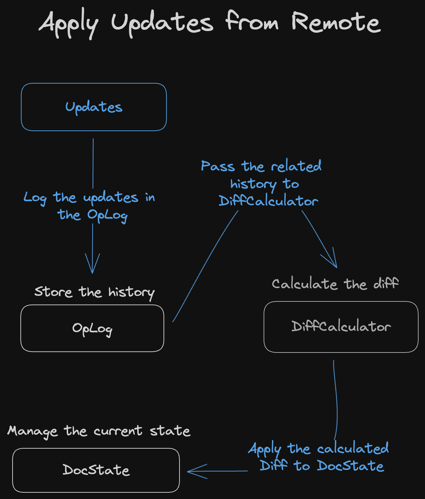

### Loro 富文本 CRDT 的实现

对于富文本，Loro 重用与 Loro List 相同的 `DiffCalculator`，该 `DiffCalculator` 基于 [Fugue] 算法。因此，与富文本相关的主要逻辑集中在 `DocState` 中。这包括表达样式、插入新字符和表示多种索引格式。

在富文本状态的表示中，我们区分了表达文本（包括样式锚点）的数据结构 `ContentTree` 和表达样式的 `StyleRangeMap`。

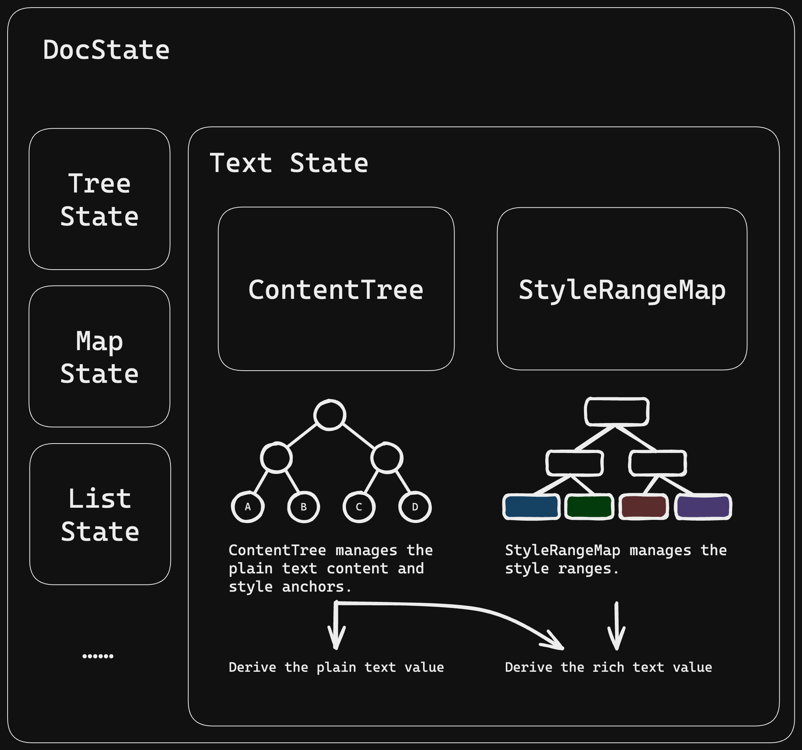

两种结构都建立在 B+树之上。

`ContentTree` 负责高效的文本查找、插入和删除。它可以使用 Unicode/UTF-8/UTF-16/实体索引来索引特定的插入/删除位置。它不存储每个文本段应具有的特定样式。

我们基于我们的 [generic-btree library](https://github.com/loro-dev/generic-btree) 构建了以下 B+树结构来在内存中表达文本：

- B+树中的每个内部节点都存储其子树的 Unicode 字符长度、UTF-16 长度、UTF-8 长度和实体长度。实体长度将样式锚点的长度视为 1，否则为 0。
- B+树的叶节点是文本或样式锚点。

`StyleRangeMap` 负责高效地更新/查询样式范围。

在表达样式的 `StyleRangeMap` B+树中：

- 每个内部节点都存储其子树的 `实体长度`。
- 每个叶节点都存储相应范围的样式信息及其 `实体长度` 的集合。

将文本 `ContentTree` 和样式 `StyleRangeMap` 分成两个结构旨在实现更好的性能优化。在富文本上，样式信息通常不丰富，并且倾向于具有良好的连续性，例如几个段落具有相同的格式，这可以用一个叶节点来表示。然而，我们用于存储文本的结构不适合具有大内容的叶节点，因为不同编码格式之间的转换时间会变得过长。

当用户在 `Unicode index` = i 处插入新字符时，会发生以下情况：

- 在 `ContentTree` 中找到 `Unicode index` = i 的位置。
- 检查此位置是否有任何相邻的样式锚点。如果没有，直接插入。
- 如果有，则根据其类型和属性决定是在相应样式锚点的左侧还是右侧插入。如果存在多个此类样式锚点，则根据[“在样式边界插入文本时的行为”](#在样式边界插入文本时的行为)一节中的内容进行插入。

### 测试

我们为 Peritext 提出的标准编写了测试，并全部通过。

为了确保我们的 CRDT 的正确性，我们添加了许多模糊测试来模拟不同的协作行为、同步行为和时间旅行行为。这些测试检查强最终一致性和内部不变量的正确性。每次关键修改后，我们都会连续运行这些模糊测试几天，以避免疏忽。

## 如何使用

在使用 Loro 的富文本模块之前，有必要定义富文本样式的配置，指定不同键的扩展行为以及是否允许重叠。

以下是在 JavaScript 中使用 Loro 富文本的示例：

```typescript
const doc = new Loro();
doc.configTextStyle({
  bold: {
    expand: "after",
  },
  comment: {
    expand: "none",
    overlap: true,
  },
  link: {
    expand: "none",
  },
});

const text = doc.getText("text");
text.insert(0, "Hello world!");
text.mark({ start: 0, end: 5 }, "bold", true);
expect(text.toDelta()).toStrictEqual([
  {
    insert: "Hello",
    attributes: { bold: true },
  },
  {
    insert: " world!",
  },
] as Delta<string>[]);

text.insert(5, "!");
expect(text.toDelta()).toStrictEqual([
  {
    insert: "Hello!",
    attributes: { bold: true },
  },
  {
    insert: " world!",
  },
] as Delta<string>[]);
```

## 总结

本文介绍了 Loro 的富文本算法设计和实现。其正确性易于证明。它可以构建在任何现有的列表 CRDT 算法之上。它允许 Loro 使用 [Eg-walker](#brief-introduction-to-replayable-event-graph) 和 [Fugue] 支持富文本协作，结合了多种 CRDT 算法的优点。

我们正在不断完善其设计，并积极寻求设计合作伙伴。我们对各种形式的反馈和建设性批评持开放態度。如果您有任何合作建议，请联系 zx@loro.dev

[Peritext]: https://www.inkandswitch.com/peritext/
[Fugue]: https://arxiv.org/abs/2305.00583
[Lamport]: https://en.wikipedia.org/wiki/Lamport_timestamp
[RGA algorithm]: https://www.sciencedirect.com/science/article/abs/pii/S0743731510002716
[Yjs]: https://github.com/yjs/yjs
[Automerge]: https://github.com/automerge/automerge
[crdt-richtext]: https://github.com/loro-dev/crdt-richtext
