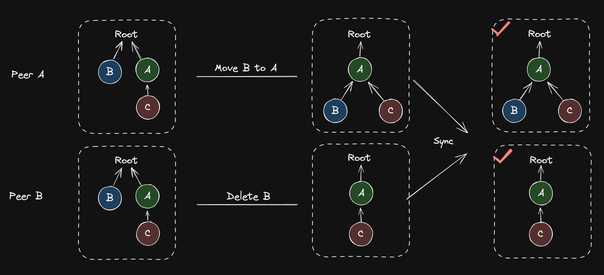
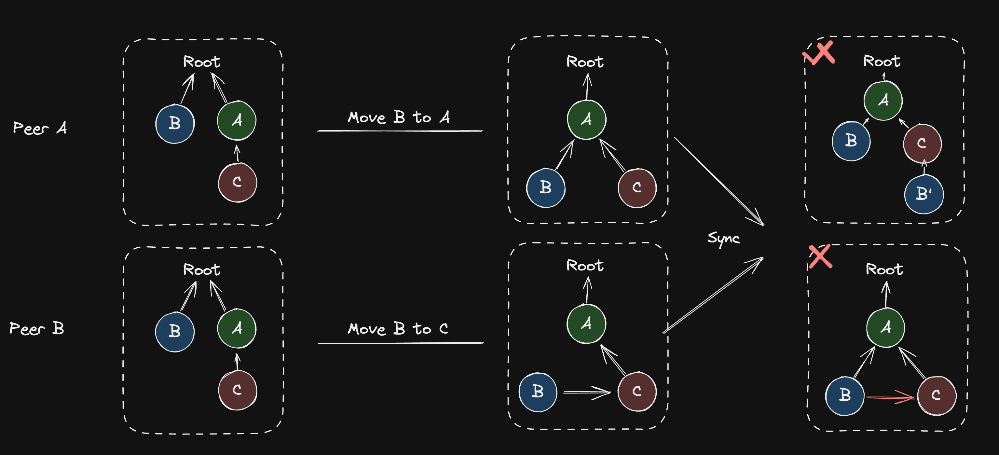
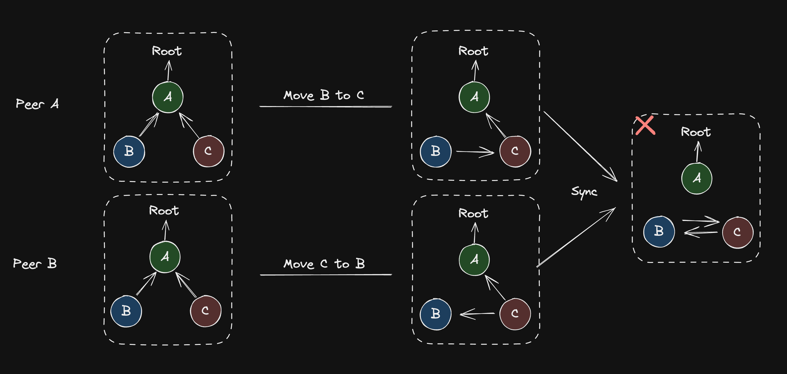
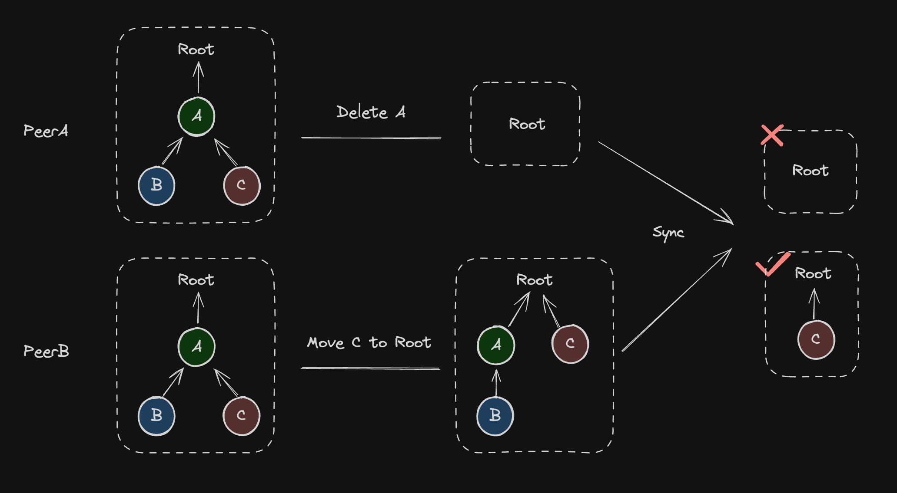
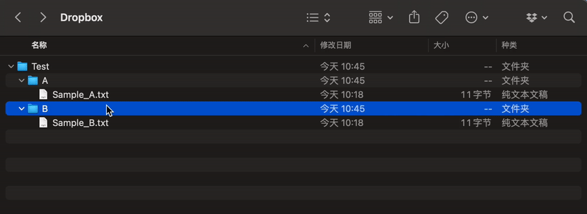
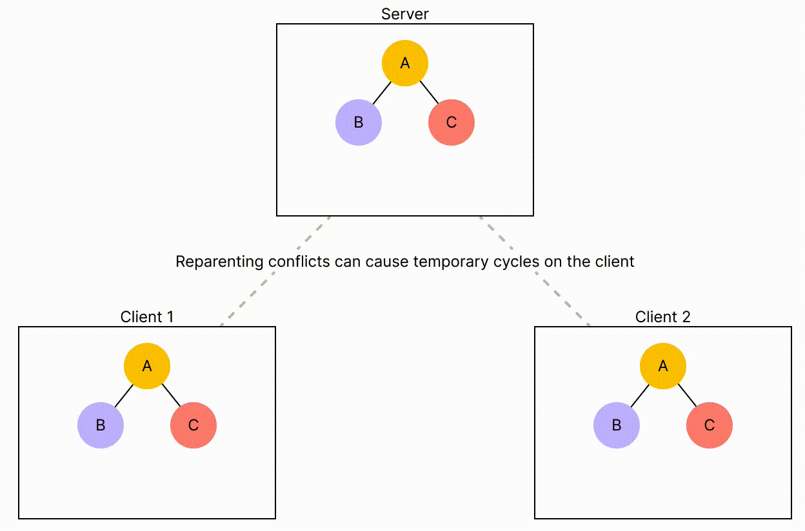
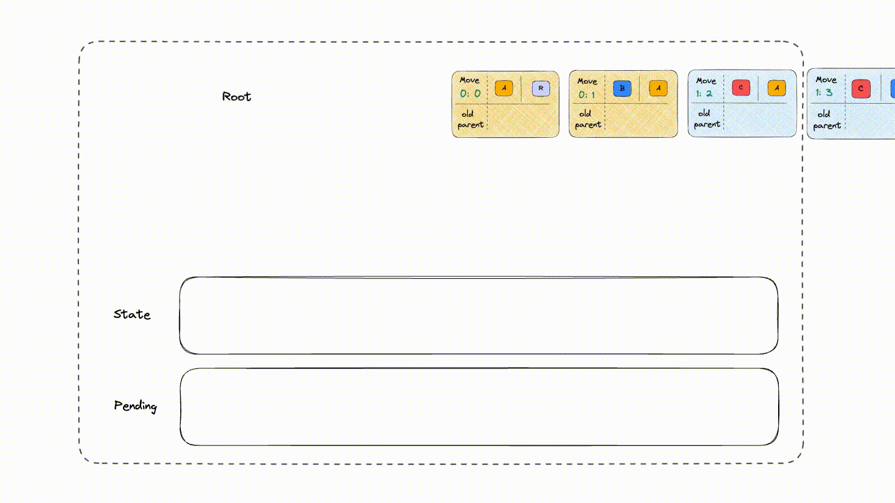
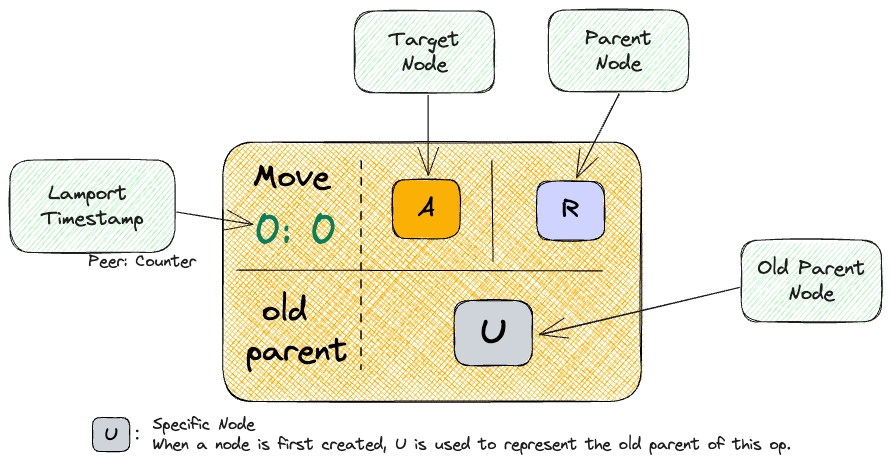
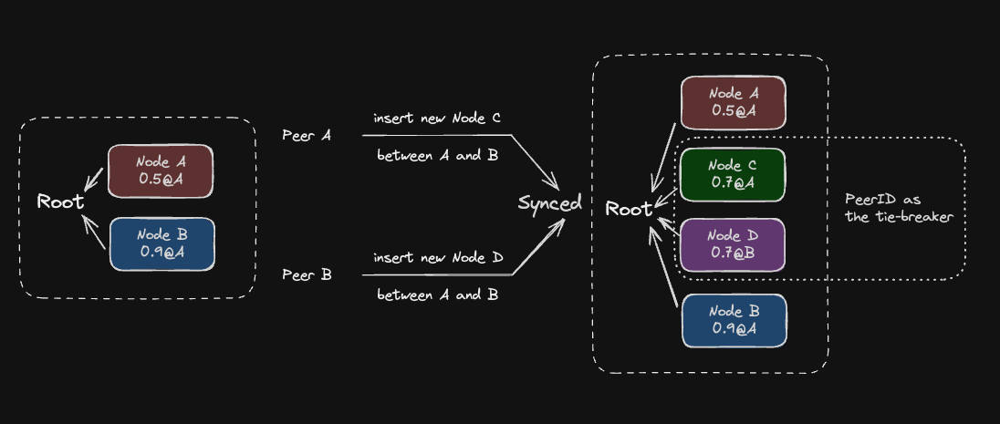
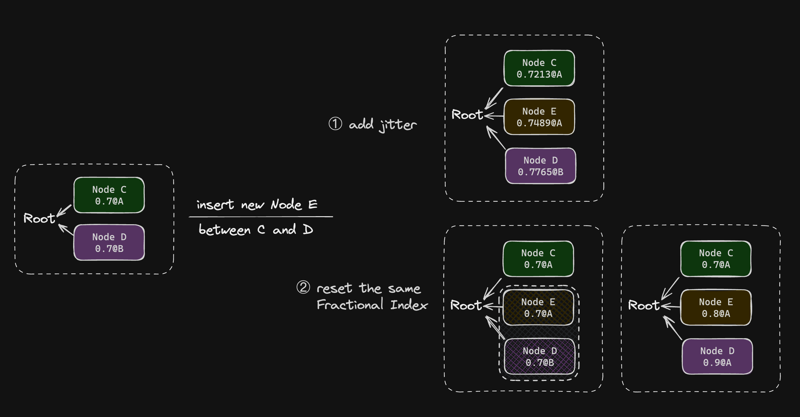

# 可移动树 CRDTs 和 Loro 的实现

import Caption from "../../components/caption";
import Authors, { Author } from "../../components/authors";

<Authors date="2024-07-18">
  <Author name="Liang Zhao" link="https://github.com/Leeeon233" />
</Authors>


本文介绍了可移动树 CRDTs 在协作时的实现困难和挑战，以及 Loro 如何实现它并对子节点进行排序。该算法具有高性能，可用于生产。

## 背景

在分布式系统和协作软件中，管理层次关系是困难和复杂的。在使用通过组合删除和插入来建模移动的数据结构时，解决冲突和满足用户期望会产生挑战。例如，如果一个节点在副本中被并发地移动到不同的父节点，可能会导致意外创建具有相同内容的重复节点。因为该节点被删除了两次并创建在两个父节点下。

目前，许多软件解决方案为在分布式环境中管理分层数据结构提供了不同级别的支持和功能。这些解决方案之间的主要区别在于它们处理潜在冲突的方法。

### 可移动树中的冲突

可移动树有 3 个主要操作：创建、删除和移动。考虑一个场景，两个对等方在同一可移动树的各自副本上独立执行各种操作。同步这些操作可能会导致潜在的冲突，例如：

- 同一个节点被删除和移动
- 同一个节点被移动到不同的节点下
- 移动了不同的节点，导致了循环
- 在移动后代节点时删除了祖先节点

#### 删除和移动同一个节点



这种情况相对容易解决。可以通过根据分布式系统中的时间戳或应用程序的特定要求应用其中一个操作而忽略另一个操作来解决。两种方法都会产生可接受的结果。

#### 将同一个节点移动到不同的父节点下



合并同一节点的并发移动操作稍微复杂一些。可以根据应用程序采用不同的方法：

- 删除该节点并在不同的父节点下创建节点的副本。后续操作然后独立地处理这些节点。当节点唯一性不重要时，这种方法是可以接受的。
- 允许该节点有两条边指向不同的父节点。然而，这种方法破坏了基本的树结构，通常不被认为是可接受的。
- 对所有操作进行排序，然后逐个应用它们。顺序可以由分布式系统中的时间戳确定。只要系统保持一致的操作顺序，它就能确保所有对等方的结果一致。

#### 移动不同的节点导致循环



导致循环的并发移动操作使可移动树的冲突解决变得复杂。Matthew Weidner 在他的[博客](https://mattweidner.com/2023/09/26/crdt-survey-2.html#forests-and-trees)中列出了几种解决循环的方案。

> 1. 错误。一些桌面文件同步应用程序在实践中会这样做（[Martin Kleppmann 等人 (2022)](https://doi.org/10.1109/TPDS.2021.3118603) 给出了一个例子）。
> 2. 将循环节点（及其后代）渲染在一个特殊的“超时”区域。它们将一直待在那里，直到某个用户手动修复循环。
> 3. 使用服务器处理移动操作。当服务器收到一个操作时，如果它会在服务器自己的状态中创建一个循环，服务器会拒绝它并告诉用户也这样做。这是 [Figma 的做法](https://www.figma.com/blog/how-figmas-multiplayer-technology-works/#syncing-trees-of-objects)。用户仍然可以乐观地处理移动操作，但在服务器确认之前它们是暂定的。（乐观更新可能会给用户造成暂时的循环；在这种情况下，Figma 使用策略 (2)：它隐藏循环节点。）
> 4. 类似，但使用[拓扑排序](https://mattweidner.com/2023/09/26/crdt-survey-2.html#topological-sort)（如下）而不是服务器的接收顺序。在按排序顺序处理操作时，如果一个操作会创建一个循环，则跳过它（[Martin Kleppmann 等人 2022](https://doi.org/10.1109/TPDS.2021.3118603)）。
> 5. 对于森林：在每个循环内，让 `B.parent = A` 是其 `set` 操作具有最大 LWW 时间戳的边。在渲染时，“隐藏”该边，而是渲染 `B.parent = "none"`，但不更改实际的 CRDT 状态。这隐藏了创建循环的并发边之一。
>    • 为了防止将来的意外，用户的应用程序应遵循以下规则：在执行任何会创建或销毁涉及隐藏边的循环的操作之前，首先通过执行将 `B.parent = "none"` 的操作来“确认”该隐藏边。
> 6. 对于树：类似，但不是渲染 `B.parent = "none"`，而是渲染 `B` 的前一个父节点——就好像错误的操作从未发生过一样。更一般地说，您可能需要回溯几个操作。 [Hall 等人 (2018)](http://dx.doi.org/10.1145/3209280.3229110) 和 [Nair 等人 (2022)](https://arxiv.org/abs/2103.04828) 都描述了类似的方法。

#### 祖先节点删除和后代节点移动



最容易被忽视的场景是在删除祖先节点时移动后代节点。如果直接删除祖先的所有后代节点，用户很容易误解他们的数据已经丢失。

### 流行应用程序如何处理冲突

Dropbox 是一款文件数据同步软件。最初，Dropbox 将文件移动视为一个两步过程：从原始位置删除，然后在新的位置创建。然而，这种方法有数据丢失的风险，尤其是在删除和创建操作之间发生停电或系统崩溃的情况下。

如今，当多个人并发移动同一个文件并尝试保存他们的更改时，Dropbox 会检测到冲突。在这种情况下，它通常会保存原始文件的一个版本，并为其中一个用户所做的更改创建一个新的[“冲突副本”](https://help.dropbox.com/organize/conflicted-copy)。



<Caption>
  该图显示了当 A 被移动到 B 文件夹，而 B 被并发地移动到 A 文件夹时发生的冲突。
</Caption>

Figma 是一款实时协作原型设计工具。他们认为树结构是协作系统中最复杂的部分，正如他们在关于多人技术的[博客文章](https://www.figma.com/blog/how-figmas-multiplayer-technology-works/#syncing-trees-of-objects)中所详述的那样。为了保持一致性，Figma 中的每个元素都有一个“parent”属性。集中式服务器在确保这些结构的完整性方面起着至关重要的作用。它监视来自不同用户的更新，并检查是否有任何操作会导致循环。如果检测到潜在的循环，服务器会拒绝该操作。

然而，由于网络延迟和类似问题，在服务器有机会拒绝它们之前，用户的更新可能会暂时创建一个循环。Figma 承认这种情况不常见。他们的[解决方案](https://www.figma.com/blog/how-figmas-multiplayer-technology-works/#syncing-trees-of-objects)简单而有效：他们暂时保留此状态并隐藏涉及循环的元素。这种方法会一直持续到服务器正式拒绝该操作，从而确保系统的稳定性和无缝的用户体验。

<div style={{ filter: "invert(1) hue-rotate(180deg)" }}>
  
</div>

<Caption>
  一个演示 [Figma](https://www.figma.com/blog/how-figmas-multiplayer-technology-works/#syncing-trees-of-objects) 如何解决冲突的动画。
</Caption>

## 可移动树 CRDTs

上面提到的应用程序使用可移动树并根据集中式解决方案解决冲突。协作树结构的另一种替代方法是使用无冲突复制数据类型 (CRDTs)。虽然最初基于 CRDT 的算法难以实现并且如先前研究中所指出的那样会产生巨大的存储开销，例如 [Abstract unordered and ordered trees CRDT](https://arxiv.org/pdf/1201.1784.pdf) 或 [File system on CRDT](https://arxiv.org/pdf/1207.5990.pdf)，但持续的优化和改进已使几种基于 CRDT 的树同步算法适用于某些生产环境。本文重点介绍了两种用于可移动树的创新的基于 CRDT 的方法。第一种由 Martin Kleppmann 等人在他们的著作 **_[A highly-available move operation for replicated trees](https://martin.kleppmann.com/2021/10/07/crdt-tree-move-operation.html)_** 中提出，第二种由 Evan Wallace 在他的 **_[CRDT: Mutable Tree Hierarchy](https://madebyevan.com/algos/crdt-mutable-tree-hierarchy/)_** 中提出。

### 一种用于复制树的高度可用的移动操作

本文将树中使用的三个操作（创建、删除和移动节点）统一为一个移动操作。移动操作被定义为一个四元组 `Move t p m c`，其中 `t` 是操作的唯一且有序的时间戳，例如 [`Lamport timestamp`](https://en.wikipedia.org/wiki/Lamport_timestamp)，`p` 是父节点 ID，`m` 是与节点关联的元数据，`c` 是子节点 ID。

如果树的所有节点都不包含 `c`，则这是一个**创建**操作，它在父节点 `p` 下创建一个子节点 `c`。否则，它是一个**移动**操作，将 `c` 从其原始父节点移动到新的父节点 `p`。此外，通过引入一个指定的 `TRASH` 节点，可以优雅地处理节点删除；将节点移动到 `TRASH` 意味着其删除，`TRASH` 的所有后代都被视为已删除。但它们仍保留在内存中，以防止并发编辑将它们移动到其他节点。为了处理前面提到的并发删除祖先节点和移动后代节点的情况。

在前面提到的三个潜在冲突中，由于删除也被定义为移动操作，**删除和移动同一个节点**被转换为两个移动操作，只剩下两个问题：

- **将同一个节点移动到不同的父节点下**
- **移动不同的节点，创建一个循环**

添加了逻辑时间戳，以便所有操作都可以线性排序，因此可以避免第一个冲突，因为它们可以表示为同一节点的两个顺序操作而不是并发操作。因此，在仅使用移动操作对树进行建模时，并发编辑中唯一的例外情况是创建一个循环，而导致循环的操作被称为**不安全操作**。

该算法根据其时间戳对所有移动操作进行排序。然后它可以按顺序应用每个操作。在应用之前，算法会检测循环以确定操作是否安全。如果操作创建了一个循环，我们忽略不安全的操作以确保树的正确结构。


基于上述方法，可移动树的一致性问题变成了以下两个问题：

1. 如何为操作引入全局顺序
2. 如何应用一个应该插入到现有已排序操作序列中间的远程操作

#### 全局有序逻辑时间戳

[Lamport Timestamp](https://en.wikipedia.org/wiki/Lamport_timestamp) 可以确定分布式系统中事件的因果顺序。它们的工作原理如下：每个对等方都以一个初始化为 `0` 的计数器开始。当本地事件发生时，计数器增加 `1`，该值成为事件的 Lamport 时间戳。当对等方 `A` 向对等方 `B` 发送消息时，`A` 将其 Lamport 时间戳附加到消息中。收到消息后，对等方 `B` 将其当前的逻辑时钟值与消息中的时间戳进行比较，并将其逻辑时钟更新为较大的值。

为了全局排序事件，我们首先查看 Lamport 时间戳：较小的数字意味着较早的事件。如果两个事件具有相同的时间戳，我们使用对等方的唯一 ID 作为决胜局。


#### 应用远程操作

操作的安全性取决于应用它时树的状态，以避免循环。插入需要评估由所有先前操作形成的状态。对于远程更新，我们可能需要：

1. 撤销最近的操作
2. 插入新操作
3. 重新应用已撤销的操作

这确保了新操作能正确地集成到现有序列中。

##### 撤销最近的操作

由于我们已将树上的所有操作建模为移动操作，因此撤销移动操作涉及将节点移回其旧父节点或撤销创建此节点的操作。为了能够快速撤销，我们在应用每个移动操作之前缓存并记录节点的**旧父节点**。

##### 应用远程操作

遇到不安全的操作时，忽略其效果可以防止创建循环。然而，记录该操作至关重要，因为操作的安全性是**动态**确定的。例如，如果我们收到并排序了一个在当前操作之前删除导致循环的另一个节点的更新，那么最初不安全的操作就变得安全了。此外，我们需要将此不安全的操作标记为无效，因为在撤销操作期间，需要查询**旧父节点**，即序列中针对此节点的最后一个有效操作的目标父节点。

##### 重新应用已撤销的操作

只有在接收到来自其他对等方的更新时才会出现循环，因此此时也需要撤销-执行-重做过程。当接收到新操作时：

```jsx
function apply(newOp)
      // 将新操作的 ID 与现有操作进行比较
      if largerThanExistingOpId(newOp.id, oplog)
          // 如果新操作的 ID 更大，则直接应用它
          oplog.applyOp(newOp)
      else
          // 如果新操作的 ID 不是最大的，则撤销操作直到可以应用它
          undoneOps = oplog.undoUtilCanBeApplied(newOp)
          oplog.applyOp(newOp)
          // 应用新操作后，重做已撤销的操作以保持序列顺序
          oplog.redoOps(undoneOps)
```

- 如果新操作依赖于本地尚未遇到的操作，则表明某些版本间的更新仍然缺失，有必要暂时缓存新操作，并等待接收到缺失的更新后再应用它。
- 将新操作与所有现有操作进行比较。如果新操作的 `opId` 大于所有现有操作的 `opId`，则可以直接应用它。如果新操作是安全的，则将目标节点的父节点记录为旧父节点，然后应用移动操作以更改当前状态。如果不安全，则将此操作标记为无效并忽略该操作的影响。
- 如果新的 opId 在现有序列的中间排序，则有必要从序列中逐个弹出排序在后面的操作，并撤销此操作的影响，即将子节点移回旧父节点，直到可以应用新操作。应用新操作后，按顺序重新应用已撤销的节点，确保所有操作都按顺序应用。

以下动画 GIF 演示了 `Peer1` 执行的过程：

1. 收到 `Peer0` 创建节点 `A`，其父节点为 `root` 节点。
2. 收到 `Peer0` 创建节点 `B`，其父节点为 `A`。
3. 创建节点 `C`，其父节点为 `A`，并将其与 `Peer0` 同步。
4. 将 `C` 移动到以 `B` 为父节点。
5. 收到 `Peer0` 将 `B` 移动到以 `C` 为父节点。

<div style={{ filter: "invert(1) hue-rotate(180deg)" }}>
  
</div>

动画右上角的队列表示本地操作和新收到的更新的顺序。每个 `Block` 中每个元素的解释如下：

<div style={{ filter: "invert(1) hue-rotate(180deg)" }}>
  
</div>

此过程中需要特别注意的一部分是两个 `lamport timestamps` 为 `0:3` 和 `1:3` 的操作。最初，将 `C` 移动到 `B` 的 `1:3` 操作在本地创建并应用，然后收到 `Peer0` 的将 `B` 移动到 `C` 的 `0:3` 操作。在 `lamport timestamp` 顺序中，`0:3` 小于 `1:3` 但大于 `1:2`（当计数器相等时，以 peer 作为决胜局）。为了应用新操作，首先撤销 `1:3` 操作，将 `C` 移回其旧父节点 `A`，然后应用将 `B` 移动到 `C` 的 `0:3` 操作。之后，重做 `1:3` 操作，再次尝试将 `C` 移动到 `B`（旧父节点仍然是 `A`，在动画中省略）。然而，在此尝试期间检测到循环，阻止了该操作生效，并且树的状态保持不变。这样就完成了一个 `undo-do-redo` 过程。

### CRDT: 可变树层次结构

Evan Wallace 开发了一种创新算法，使每个节点能够跟踪其所有历史父节点，并为每个记录的父节点附加一个计数器。新父节点的计数值比该节点所有历史父节点的计数值高 1，表示该节点父节点的更新顺序。计数值最高的父节点被视为当前父节点。

在同步期间，此父节点信息也会同步。如果出现循环，启发式算法会将导致循环的节点重新附加到不会导致循环且连接到根节点的最近的历史父节点，从而更新父节点记录。重复此过程，直到所有导致循环的节点都重新附加到树上，从而实现树结构的所有副本同步。 [Evan 的博客](https://madebyevan.com/algos/crdt-mutable-tree-hierarchy/) 中的演示清楚地说明了此过程。

正如 Evan 在文章末尾总结的那样，该算法不需要昂贵的 `undo-do-redo` 过程。然而，每次收到远程移动时，算法都需要确定所有节点是否都连接到根节点，并将导致循环的节点重新附加到树上，当节点过多时，这可能会表现不佳。

我建立了一个[基准测试](https://github.com/Leeeon233/movable-tree-crdt)来比较可移动树算法的性能。

## Loro 中可移动树 CRDTs 的实现

Loro 实现了 Martin Kleppmann 等人提出的算法，**_[A highly-available move operation for replicated trees](https://martin.kleppmann.com/2021/10/07/crdt-tree-move-operation.html)_**。一方面，该算法在大多数实际场景中具有高性能。另一方面，该算法的核心 `undo-do-redo` 过程与 Loro 中 Eg-walker (Event Graph Walker) 应用远程更新的方式高度相似。关于 **Eg-walker** 的介绍可以在我们之前的[博客](https://www.loro.dev/blog/loro-richtext#brief-introduction-to-replayable-event-graph)中找到。

Movable tree has been introduced in detail, but there is still another problem of tree structure that has not been solved. For movable tree, in some real use cases, we still need the capability to sort child nodes. This is necessary for outline notes or layer management in graphic design softwares. Users need to adjust node order and sync it to other collaborators or devices.

我们将 `Fractional Index` 算法集成到 Loro 中，并将其与可移动树相结合，使可移动树的子节点可排序。

网上有很多关于 `Fractional Index` 的介绍，您可以在 [Figma 博客](https://www.figma.com/blog/realtime-editing-of-ordered-sequences)或 [Evan 博客](https://madebyevan.com/algos/crdt-fractional-indexing/)中阅读更多关于 `Fractional Index` 的内容。简单来说，`Fractional Index` 为每个对象分配一个可排序的值，如果在新插入发生在两个对象之间，新对象的 `Fractional Index` 将介于左右值之间。我们在这里更想说的是如何在 CRDTs 系统中处理 `Fractional Index` 带来的潜在冲突。

### 子节点排序中的潜在冲突

由于我们的应用程序处于分布式状态，当多个对等方在同一位置插入新节点时，会为这些内容不同但位置相同的节点分配相同的 `Fractional Index`。当来自远程的更新应用到本地时，由于遇到相同的 `Fractional Index` 而产生冲突。

在 Loro 中，我们保留这些相同的 `Fractional Index`，并使用 `PeerID`（每个对等方的唯一 ID）作为相同 `Fractional Index` 相对顺序判断的决胜局。



虽然这解决了来自不同对等方的相同 `Fractional Index` 节点之间的排序问题，但它影响了新 `Fractional Index` 的生成，因为我们无法在两个相同的 `Fractional Index` 之间生成新的 `Fractional Index`。我们使用两种方法来解决这个问题：

1. 第一种方法，如 Evan 的博客中所述，我们可以为每个生成的 `Fractional Index` 添加一定量的抖动（为便于解释，以下所有示例均以十进制小数作为 `Fractional Index`），例如，在 0 和 1 之间生成新的 `Fractional Index` 时，它本应是 0.5，但通过随机抖动，它可能是 `0.52712`、`0.58312`、`0.52834` 等，从而显着减少出现相同 `Fractional Index` 的机会。
2. 如果出现两边都存在相同 `Fractional Index` 的情况，我们可以通过重置这些 `Fractional Index` 来处理这个问题。例如，如果我们需要在 `0.7@A` 和 `0.7@B`（表示 `Fractional Index` @ `PeerID`）之间插入一个新节点，而不是在 0.7 和 0.7 之间生成新的 `Fractional Index`，我们可以分别为新节点和 `0.7@B` 节点在 0.7 和 1 之间分配两个新的 `Fractional Index`，这可以理解为额外的移动操作。



### 实现和编码大小

引入 `Fractional Index` 带来了节点序列的优势。编码大小呢？

Loro 使用基于 `Vec<u8>` 的 [drifting-in-space](https://github.com/drifting-in-space/fractional_index) `Fractional Index` 实现，即以 256 为基数。换句话说，您需要从默认值向前或向后连续插入 128 个值，才能使 `Fractional Index` 的字节大小增加 1。最坏的存储开销情况，例如每次交替插入新值。例如，初始序列是 `ab`，在 `a` 和 `b` 之间插入 `c`，然后在 `c` 和 `b` 之间插入 `d`，然后在 `c` 和 `d` 之间插入 `e`，就像：

```js no_run
ab    // [128] [129, 128]
acb   // [128] [129, 127, 128] [129, 128]
acdb  // [128] [129, 127, 128] [129, 127, 129, 128] [129, 128]
acedb // [128] [129, 127, 128] [129, 127, 129, 127, 128] [129, 127, 129, 128] [129, 128]
```
一个新操作会导致需要一个额外的字节。但这种情况非常罕见。

考虑到在大多数应用程序中潜在的冲突不会频繁出现，Loro 只是扩展了实现，原始实现通过在 `Vec<u8>` 的某个索引处仅增加或减少 1 来生成新的 `Fractional Index` 以实现相对排序。添加了简单的抖动解决方案，通过在 `Fractional Index` 后附加长度为抖动值的随机字节。要在 js 中启用抖动，您可以使用 `doc.setFractionalIndexJitter(number)` 并提供一个正值。但这会略微增加编码大小，但每个 `Fractional Index` 只增加 `jitter` 字节。如果您希望在同一位置生成 `Fractional Index` 且有 99% 的概率不发生冲突，`jitter` 设置与最大并发编辑数 `n` 之间的关系将是：

<table style={{ margin: "0 auto" }}>
  <thead>
    <tr class="nx-m-0 nx-border-t nx-border-gray-300 nx-p-0 dark:nx-border-gray-600 even:nx-bg-gray-100 even:dark:nx-bg-gray-600/20">
      <th class="nx-m-0 nx-border nx-border-gray-300 nx-px-4 nx-py-2 nx-font-semibold dark:nx-border-gray-600">
        抖动
      </th>
      <th class="nx-m-0 nx-border nx-border-gray-300 nx-px-4 nx-py-2 nx-font-semibold dark:nx-border-gray-600">
        最大并发编辑数
      </th>
    </tr>
  </thead>
  <tbody>
    <tr class="nx-m-0 nx-border-t nx-border-gray-300 nx-p-0 dark:nx-border-gray-600 even:nx-bg-gray-100 even:dark:nx-bg-gray-600/20">
      <td class="nx-m-0 nx-border nx-border-gray-300 nx-px-4 nx-py-2 dark:nx-border-gray-600">
        1
      </td>
      <td class="nx-m-0 nx-border nx-border-gray-300 nx-px-4 nx-py-2 dark:nx-border-gray-600">
        3
      </td>
    </tr>
    <tr class="nx-m-0 nx-border-t nx-border-gray-300 nx-p-0 dark:nx-border-gray-600 even:nx-bg-gray-100 even:dark:nx-bg-gray-600/20">
      <td class="nx-m-0 nx-border nx-border-gray-300 nx-px-4 nx-py-2 dark:nx-border-gray-600">
        2
      </td>
      <td class="nx-m-0 nx-border nx-border-gray-300 nx-px-4 nx-py-2 dark:nx-border-gray-600">
        37
      </td>
    </tr>
    <tr class="nx-m-0 nx-border-t nx-border-gray-300 nx-p-0 dark:nx-border-gray-600 even:nx-bg-gray-100 even:dark:nx-bg-gray-600/20">
      <td class="nx-m-0 nx-border nx-border-gray-300 nx-px-4 nx-py-2 dark:nx-border-gray-600">
        3
      </td>
      <td class="nx-m-0 nx-border nx-border-gray-300 nx-px-4 nx-py-2 dark:nx-border-gray-600">
        582
      </td>
    </tr>
  </tbody>
</table>

当存在大量 `Fractional Index` 时，排序后会有许多公共前缀，当 Loro 编码这些 `Fractional Index` 时，会实现前缀优化。每个 `Fractional Index` 只保存与前一个 `Fractional Index` 相同的前缀位数和剩余字节，这进一步减小了整体编码大小。

### 相关工作

除了使用 Fractional Index，还有其他可移动列表 CRDT 可以使树的兄弟节点有序。其中一种算法是 Martin Kleppmann 的 [Moving Elements in List CRDTs](https://martin.kleppmann.com/2020/04/27/papoc-list-move.html)，该算法已在 Loro 的 [Movable List](https://www.loro.dev/docs/tutorial/list) 中使用。


相比之下，`Fractional Index` 解决方案的实现更简单，并且在树中对节点进行建模时没有为子节点提供稳定的位置表示，否则整体树结构会过于复杂。然而，`Fractional Index` 存在[交错](https://vlcn.io/blog/fractional-indexing#interleaving)问题，但当某些只需要相对顺序而不需要严格顺序语义时，这是可以接受的，例如 figma 图层项、多级书签等。

## 基准测试

我们对 Loro 的可移动树实现进行了性能基准测试，包括随机节点移动、切换到历史版本以及在树结构非常深的情况下极端条件下的性能。结果表明，它能够支持实时协作并实现无缝的历史版本检出。

| 任务 | 时间 | 设置 |
| :---------------------------------------- | :----- | :------------------------------------------------ |
| 随机移动 10000 次 | 28 毫秒 | 首先创建 1000 个节点 |
| 切换到不同版本 1000 次 | 153 毫秒 | 首先创建 1000 个节点并移动 1000 次 |
| 在深度为 300 的树中切换到不同版本 1000 次 | 701 毫秒 | 新节点是前一个节点的子节点 |

<Caption>
  测试环境：M2 Max CPU，您可以在[此处](https://github.com/loro-dev/loro/blob/main/crates/loro-internal/benches/tree.rs)找到基准测试代码。
</Caption>

## 用法

```tsx
import { Loro, LoroTree, LoroTreeNode, LoroMap } from "loro-crdt";

let doc = new Loro();
let tree: LoroTree = doc.getTree("tree");
let root: LoroTreeNode = tree.createNode();
// 默认情况下，附加到父节点子列表的末尾
let node = root.createNode();
// 指定子节点的位置
let node2 = root.createNode(0);
// 将 `node2` 移动为 `node` 的最后一个子节点
node2.move(node);
// 将 `node` 移动为 `node2` 的第一个子节点
node.move(node2, 0);
// 将节点移动为根节点
node.move();
// 将节点移动到另一个节点之后
node.moveAfter(node2);
// 将节点移动到另一个节点之前
node.moveBefore(node2);
// 检索节点在其父节点子节点中的索引
let index = node.index();
// 获取节点的 `Fractional Index`
let fractionalIndex = node.fractionalIndex();
// 访问关联的数据映射容器
let nodeData: LoroMap = node.data;
```

### 演示

我们使用 Loro 开发了一个模拟的 Todo 应用程序，可在多个对等方之间进行数据同步，包括使用 `Movable Tree` 表示子任务关系，使用 `Map` 表示任务的各种属性，使用 `Text` 表示任务标题等。除了基本的创建、移动、修改和删除外，我们还实现了基于 Loro 的版本切换。您可以拖动滚动条在所有已操作的历史版本之间切换。

<iframe
  src="https://loro-movable-tree-demo.zeabur.app"
  style={{
    width: "100%",
    height: 700,
    border: 0,
    borderRadius: 8,
    marginTop: 16,
    overflow: "hidden",
  }}
  width="100%"
  height="750px"
/>

## 总结

本文讨论了实现可移动树 CRDTs 的困难，并介绍了两种用于可移动树的创新算法。

对于实现，Loro 集成了 **_[A highly-available move operation for replicated trees](https://martin.kleppmann.com/2021/10/07/crdt-tree-move-operation.html)_** 来实现树的层次移动，并集成了 [drifting-in-space](https://github.com/drifting-in-space/fractional_index) 的 `Fractional Index` 实现来实现子节点之间的移动。这可以满足各种应用场景的需求。

如果您正在开发协作应用程序或对 CRDT 算法感兴趣，欢迎加入[我们的社区](https://discord.gg/tUsBSVfqzf)。
