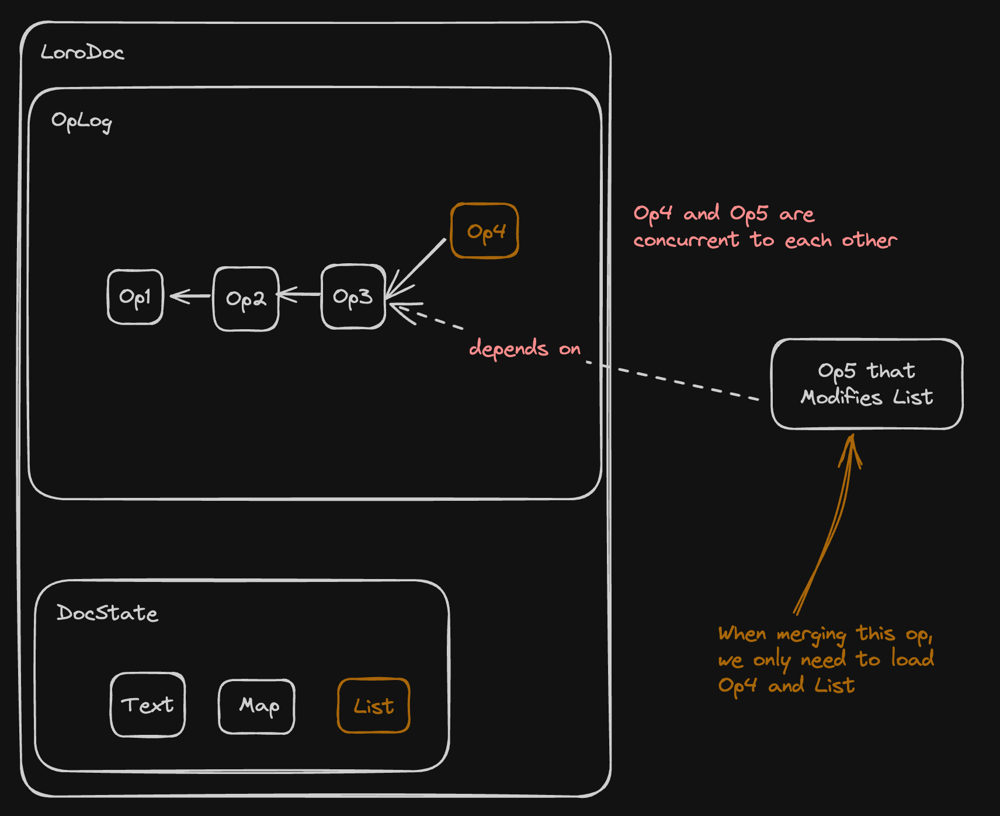

# Loro 1.0

import Authors, { Author } from "../../../components/authors";

<Author
  name="Zixuan Chen"
  link="https://twitter.com/https://twitter.com/zx_loro"
/>
<Author name="Liang Zhao" link="https://github.com/Leeeon233" />

import Image from "next/image";

Loro 是一个[无冲突复制数据类型 (CRDT)](https://crdt.tech/) 库，开发人员可以使用它在他们的应用程序中实现实时协作和版本控制。您可以使用 Loro 创建[本地优先软件](https://www.inkandswitch.com/local-first/)。Loro 1.0 具有稳定的数据格式、出色的性能和丰富的功能。您可以在 Rust、JS (通过 WASM) 和 Swift 中使用它。

<details>
<summary>什么是 CRDT？它有什么用？</summary>

分布式状态现在在多用户协作应用程序和需要多设备同步的应用程序中无处不在。您需要确保跨设备的一致性。CRDTs 提供了一种分散的方式来自动解决这个问题。

> CRDTs 自动解决冲突并确保数据的一致性。一些 CRDT 算法为合并结果提供了额外的属性，这些属性应尽可能与用户期望保持一致。

CRDT 提供了一种分散的方式来解决这个问题。这里的去中心化不仅意味着它可以通过 P2P 方法进行同步，还意味着：

- 它允许应用程序自然地支持离线编辑
- 它允许用户在多个不同位置存储和实现数据的双向同步
- 它使后端更容易实现水平扩展
- 它可以轻松支持端到端加密

CRDTs 曾被认为无法用于严肃和复杂的场景，例如富文本，但近年来的优化极大地扩展了其应用场景，使其成为一种实用且易于使用的技术。

基于 CRDT，我们可以创建允许用户完全控制数据所有权的应用程序。这些应用程序可以像 Git 管理的存储库一样，不依赖于特定的软件服务提供商。用户可以在 GitHub、GitLab、自托管的 Git 服务器之间切换，数据始终在本地可用。这是[本地优先软件](https://www.inkandswitch.com/local-first/)的愿景。

<aside>
❓ **通过 CRDT 同步和通过 Git 同步有什么区别？**

Git 的协议不支持实时协作。当存在并发编辑时，Git 需要手动解决冲突；而 CRDT 可以支持实时协作，可以扩展以支持富文本，并支持具有类似 JSON 模式的数据。

</aside>

CRDTs 通常还提供一种更简单、更易于使用的同步方法，因为对于像 Loro 这样的基于操作的 CRDTs，只要两个对等方接收到的 CRDT 操作集一致，这两个对等方的 CRDT 文档状态就一致。您不必担心幂等性、操作应用顺序和网络异常处理。对于 Loro 的 CRDT 文档，只需两轮数据交换即可传输两个文档之间缺失的操作，以实现最终一致性：

> 您可以在[此处](https://github.com/https://twitter.com/zx_loro/loro-blog-examples)找到本博客中的所有代码示例

```jsx
import { LoroDoc, VersionVector } from "npm:loro-crdt@1.0.0-beta.3";

const docA = new LoroDoc();
const docB = new LoroDoc();
docA.setPeerId(0);
docA.setPeerId(1);

docA.getText("text").insert(0, "Hello!");
docB.getText("text").insert(0, "Hi!");
const versionA: Uint8Array = docA.version().encode();
const versionB: Uint8Array = docB.version().encode();

// 交换 versionA 和 versionB 信息
const bytesA: Uint8Array = docA.export({
    mode: "update",
    from: VersionVector.decode(versionB),
});
const bytesB: Uint8Array = docB.export({
    mode: "update",
    from: VersionVector.decode(versionA),
});

// 交换 bytesA 和 bytesB
docB.import(bytesA);
docA.import(bytesB);

console.log(docA.getText("text").toString()); // Hello!Hi!
console.log(docB.getText("text").toString()); // Hello!Hi!
```

<details>
<summary>
最少一轮数据交换即可确保一致性
</summary>

```jsx
import { LoroDoc } from "npm:loro-crdt@1.0.0-beta.2";

const docA = new LoroDoc();
const docB = new LoroDoc();
docA.setPeerId(0);
docA.setPeerId(1);
docA.getText("text").insert(0, "Hello!");
docB.getText("text").insert(0, "Hi!");

// 交换 versionA 和 versionB 信息
const bytesA: Uint8Array = docA.export({
    mode: "update",
});
const bytesB: Uint8Array = docB.export({
    mode: "update",
});

// 交换 bytesA 和 bytesB
docB.import(bytesA);
docA.import(bytesB);

console.log(docA.getText("text").toString()); // Hello!Hi!
console.log(docB.getText("text").toString()); // Hello!Hi!
```

</details>
</details>

## Loro 1.0 的特性

### 高性能 CRDTs

高性能、通用的 CRDTs 可以显着降低数据同步的复杂性，对于本地优先的开发至关重要。

然而，大型 CRDT 文档可能会面临加载速度和内存消耗的挑战，尤其是在处理具有大量编辑历史的文档时。
Loro 1.0 通过一种新的存储格式解决了这一挑战，实现了 10 倍的加载速度提升。在[使用 Loro 和真实世界编辑数据的基准测试](#document-import-speed-benchmarks)中，我们将一个包含数百万次操作的文档的加载时间从 16 毫秒减少到 1 毫秒。当使用浅快照格式（稍后讨论）时，时间可以进一步减少到 0.37 毫秒。
因此，Loro 不会成为处理此类大型文档的应用程序的瓶颈。
它扩展了 CRDTs 的潜在用例，使其适用于更广泛的应用程序。

### 丰富的 CRDT 类型

Loro 现在支持[富文本 CRDT](https://loro.dev/blog/loro-richtext)，它增强了富文本（带有格式和样式的文本）的合并结果，以更好地与用户期望保持一致。
我们的文本/列表 CRDT 基于 [Fugue](https://arxiv.org/abs/2305.00583) 算法。
它在合并并发编辑时可以防止交错问题。例如，当并发插入“123”和“Hi”时，它可以避免像“1H2i3”这样的意外合并。

我们还支持：

- 可移动列表：支持设置、插入、删除和移动操作。该算法确保在合并并发移动后，每个元素只占据一个位置。
- Map：类似于 JavaScript 对象。
- [可移动树](https://loro.dev/blog/movable-tree)：用于对文件目录、大纲编辑器和其他可能需要移动的层次结构进行建模。它确保在合并并发移动操作后，树中不存在循环依赖。

Loro 还支持类型之间的嵌套，因此您可以通过它们对 JSON 文档上的编辑进行建模：

> 您可以在[此处](https://github.com/https://twitter.com/zx_loro/loro-blog-examples)找到本博客中的所有代码示例

```tsx
import {
  LoroDoc,
  LoroList,
  LoroMap,
  LoroText,
} from "npm:loro-crdt@1.0.0-beta.2";

// 创建一个 JSON 结构
interface JsonStructure {
  users: LoroList<
    LoroMap<{
      name: string;
      age: number;
    }>
  >;
  notes: LoroList<LoroText>;
}

const doc = new LoroDoc<JsonStructure>();
const users = doc.getList("users");
const user = users.insertContainer(0, new LoroMap());
user.set("name", "Alice");
user.set("age", 20);
const notes = doc.getList("notes");
const firstNote = notes.insertContainer(0, new LoroText());
firstNote.insert(0, "Hello, world!");

// { users: [ { age: 20, name: "Alice" } ], notes: [ "Hello, world!" ] }
console.log(doc.toJSON());
```

### 版本控制

与 Git 类似，Loro 保存了编辑历史的完整有向无环图 (DAG)。在 Loro 中，DAG 用于表示编辑之间的依赖关系，类似于 Git 表示提交历史的方式。

Loro 支持允许用户在不同版本之间切换、创建新分支、在新分支上编辑和合并分支的原语。

基于此操作原语，应用程序可以构建各种类似 Git 的功能：

- 您可以合并多个版本，而无需手动解决冲突
- 您可以将当前分支的更新变基/压缩到目标分支 (WIP)

```jsx
import { LoroDoc } from "npm:loro-crdt@1.0.0-beta.2";

const doc = new LoroDoc();
doc.setPeerId("0");
doc.getText("text").insert(0, "Hello, world!");
doc.checkout([{ peer: "0", counter: 1 }]);
console.log(doc.getText("text").toString()); // "He"
doc.checkout([{ peer: "0", counter: 5 }]);
console.log(doc.getText("text").toString()); // "Hello,"
doc.checkoutToLatest();
console.log(doc.getText("text").toString()); // "Hello, world!"

// 模拟并发编辑
doc.checkout([{ peer: "0", counter: 5 }]);
doc.setDetachedEditing(true);
doc.setPeerId("1");
doc.getText("text").insert(6, " Alice!");
// ┌───────────────┐     ┌───────────────┐
// │    Hello,     │◀─┬──│     world!    │
// └───────────────┘  │  └───────────────┘
//                    │
//                    │  ┌───────────────┐
//                    └──│     Alice!    │
//                       └───────────────┘
doc.checkoutToLatest();
console.log(doc.getText("text").toString()); // "Hello, world! Alice!"
```

您还可以使用 `doc.fork()` 在当前版本创建一个独立的文档。它独立于当前文档，工作方式类似于 fork：

```tsx
import { LoroDoc } from "npm:loro-crdt@1.0.0-beta.4";

const doc = new LoroDoc();
doc.setPeerId("0");
doc.getText("text").insert(0, "Hello, world!");
doc.checkout([{ peer: "0", counter: 5 }]);
const newDoc = doc.fork();
newDoc.setPeerId("1");
newDoc.getText("text").insert(6, " Alice!");
// ┌───────────────┐     ┌───────────────┐
// │    Hello,     │◀─┬──│     world!    │
// └───────────────┘  │  └───────────────┘
//                    │
//                    │  ┌───────────────┐
//                    └──│     Alice!    │
//                       └───────────────┘
doc.import(newDoc.export({ mode: "update" }));
doc.checkoutToLatest();
console.log(doc.getText("text").toString()); // "Hello, world! Alice!"
```

<aside>
**Loro 中版本控制的当前限制**

应用层仍然需要大量代码来为用户提供更完整的版本控制功能，例如：

- 存储和同步版本标签和分支
- 显示差异视图
- 处理变基和合并交互
- ...

这些问题不适合在当前的 Loro CRDTs Lib 中解决，因为对模式和环境的过多假设会使其难以在其他场景中使用，因此我们不会构建这些部分。但它们都可以通过额外的库来解决。

</aside>

### 利用 [Eg-walker](https://arxiv.org/abs/2409.14252) 的潜力

import { ReactPlayer } from "../../../components/video";
import Caption from "../../../components/caption";

<ReactPlayer
  url="/static/REG.mp4"
  style={{ maxWidth: "calc(100vw - 40px)" }}
  width={512}
  height={512}
  muted={true}
  loop={true}
  controls={true}
  playing={true}
/>

[Event Graph Walker (Eg-walker)](/docs/advanced/event_graph_walker) 是一种开创性的协作算法，它结合了操作转换 (OT) 和 CRDT 的优点，这两种算法是实时协作中广泛使用的两种算法。

虽然 OT 是集中式的，CRDT 是分散式的，但 OT 传统上在文档开销方面具有优势。CRDTs 最初具有较高的开销，但最近的优化已显着缩小了这一差距，使 CRDTs 越来越具有竞争力。
Eg-walker 利用了两种方法的最佳方面。

我们不仅在 Loro 中将 Eg-walker 的思想用于文本和列表 CRDTs，而且 Loro 的整体架构也深受 Eg-walker 的启发。因此，Loro 在算法属性方面与 Eg-walker 非常相似。

<aside>
在实现细节方面，Loro 与论文中描述的 Eg-walker 不同。因此，说 Loro 实现了 Eg-walker 可能存在争议。

例如，Loro 支持除文本之外的其他类型，在 Loro 中，我们存储文档状态中每个字符的 ID（但不存储墓碑），等等。

但它实现了 Eg-walker 的思想，即遍历图以构建用于冲突解决的临时 CRDTs。而且，与 Eg-walker 一样，Loro 不需要将 CRDT 结构保存在内存中即可编辑文档。

</aside>

[Eg-walker 论文](https://arxiv.org/abs/2409.14252) 于 2023 年 9 月发布。在其正式发布之前，Joseph Gentle 在 Diamond-Type 存储库中分享了该算法的初始版本。受该设计的启发，我两年前在 Loro 中实现了类似的算法。该算法的简要介绍可以在[此处](https://loro.dev/docs/advanced/event_graph_walker)找到。

Eg-walker 的属性包括：

- 它本身符合 CRDT 的定义，因此具有 CRDT 的强最终一致性属性，因此可用于分布式环境
- 快速的本地操作速度：与以前的 CRDTs 相比，它处理操作的速度极快，因为它不需要根据 CRDT 数据结构生成相应的操作
- 快速合并远程操作：OT 合并远程操作的复杂度为 O(n^2)，而 Eg-walker 与主流 CRDTs 一样，为 O(nlogn)，仅在极少数最坏情况下达到 O(n^2)。这意味着当并发操作数达到 10,000 时，OT 会开始向用户显示明显的延迟，而 CRDTs 可以轻松处理。在大多数真实世界场景的基准测试中，它比其他 CRDTs 更快。
- 较低的内存使用率：因为它不需要在内存中持久存储 CRDT 结构，所以其内存使用率低于通用 CRDTs
- 更快的导入速度：CRDT 文档通常需要很长时间才能加载，因为它们需要解析相应的 CRDT 结构或操作来构建 CRDT 数据结构。没有这些结构，它们就无法继续后续的编辑，从而导致导入时间过长。Eg-walker 与 OT 算法一样，只需要当前的文档状态，而不需要构建这些额外的结构即可让用户直接开始编辑文档，从而实现更快的导入速度

<aside>
💡 **Loro 和 Eg-walker 之间的差异**

虽然 Loro 的灵感来自 Eg-walker，但总的来说，Loro 的功能与论文中描述的 Eg-walker 的功能不同。以下是具体差异：

- 在本地操作和导入更新的性能特征方面，Loro 和 Eg-walker 相似。
- Loro 支持除文本之外的多种数据类型，例如 Map、List、Movable List、Tree、Counter 等。某些 CRDT 类型不容易直接与 Eg-walker 结合，因此我们需要在 Loro 中进行额外的适配和调整。
- Loro 的文档状态具有额外的元数据，包括每个字符的 ID。此元数据用于支持光标同步和其他功能。文本上的 ID 可以为评论等功能提供稳定的位置信息表达。
- 在 Eg-walker 论文中描述的算法中，用户 A 和 B 可以从同一个纯文本文档初始化一个 CRDT 文档并开始协作，而无需任何历史信息。此外，形成这两个纯文本文档的历史可以不同。然而，在 Loro 中，有必要确保 A 和 B 协作的文档的历史是相同的。
- 我们的文本不仅支持纯文本，还支持富文本，其中包括粗体、斜体和字体样式等格式属性。这使得我们的文本数据格式与纯文本不同，无法直接使用纯文本描述方法进行描述。
- Loro 的设计不仅支持实时协作，还支持版本控制。因此，我们为每个操作提供了额外的数据结构和信息，以便更快地切换版本。

</aside>

在过去的一个季度里，我们进行了重大的架构调整，以使 Loro 能够进一步利用 Eg-walker 算法的优势。以下是我们的成就

#### 浅快照

默认情况下，Loro 像 Git 一样存储文档的完整编辑历史，因为[Eg-walker 算法在合并远程编辑时需要加载与它们并行且与最低共同祖先并行的编辑](https://loro.dev/docs/advanced/event_graph_walker)。浅快照就像 Git 的浅克隆，可以移除用户不需要的旧历史操作，从而大大减小文档大小并提高文档导入和导出速度。这使您可以冷存储过旧的文档历史，并主要使用浅文档进行协作。以下是一个用法示例：

```jsx
import { LoroDoc } from "npm:loro-crdt@1.0.0-beta.2";

const doc = new LoroDoc();
for (let i = 0; i < 10_000; i++) {
  doc.getText("text").insert(0, "Hello, world!");
}
const snapshotBytes = doc.export({ mode: "snapshot" });
const shallowSnapshotBytes = doc.export({
  mode: "shallow-snapshot",
  frontiers: doc.frontiers(),
});

console.log(snapshotBytes.length); // 5421
console.log(shallowSnapshotBytes.length); // 869
```

有关实现原理的详细信息，请参阅[浅快照](/docs/advanced/shallow_snapshot)。

#### 优化的文档格式

Loro 1.0 版本的文档导入速度比 0.16 版本提高了 10 到 100 倍，而 0.16 版本已经具有很快的导入速度。
这使得在不到一帧的时间内加载一个包含数百万次操作的大型文本文档成为可能。

这是因为我们引入了一种新的快照格式。
当通过此快照格式初始化 LoroDoc 时，我们不会解析相应的文档状态和历史信息，直到用户实际需要该信息。

<aside>
💡 **Loro 在导入更新/快照之前执行完整性检查**

我们在每次导出时附加一个 4 字节的 xxhash32 校验和，以防止数据损坏。
虽然这不能防止恶意篡改，但它在检测由传输错误或存储故障引起的问题方面既快速又有效。

我们包含完整性检查的主要动机是以相对较低的成本避免由数据错误引起的错误。因为 Loro 使用自己的二进制编码格式，这与用户可理解的文档格式（如 JSON）不同，如果发生数据错误，故障排除将极其困难。

</aside>

在 Loro 1.0 的快照格式中，不使用压缩算法，其文档大小是旧版本的两倍（以及其他主流 CRDTs）。这种额外的大小主要来自于在 1.0 快照格式中编码历史操作+文档状态，而没有在两者之间重用存储的数据，而在旧版本中，我们使用历史操作的顺序来编码文档的当前状态（旧版本的编码借鉴了[Automerge 编码的 Value Column](https://automerge.org/automerge-binary-format-spec/#_value_column)）。

用两倍的文档大小换取十倍的导入速度是值得的，因为导入速度影响许多方面的性能，而 CRDT 文档的导入速度[在大型文档上通常对用户是可感知的](https://loro.dev/docs/performance)（> 16ms）。它也为将来更多的优化留下了可能性。

<aside>
❓ **这会影响数据传输的效率吗？**

这取决于场景：

1. 对于实时协作：
   - 我们不需要连续传输整个快照。
   - 我们只需要文档更新（其他对等方缺失的操作）。
   - 不使用上面提到的快照格式，因此传输量保持不变。

2. 当需要从远程加载文档时：
   - 如果使用完整的快照，它将是以前的两倍大。
   - 但是，您有选择：
     1. 使用浅快照格式。
     2. 为其他对等方导出一整套更新，让他们计算最新的文档状态。

3. 对于本地存储：
   - 用户通常对本地存储成本不太敏感。
   - 快照格式可用于本地持久化，而不会产生重大影响。

</aside>

受键值数据库设计的启发，我们还将文档状态和历史的存储划分为块，每个块大约 4KB，这样当用户真正需要一段历史时，我们只需要解压缩并读取这 4KB 的内容，而无需解析整个文档。这导致了导入速度的质的提高，并且由于序列化格式可以更好地压缩历史和状态，内存使用率也比以前更低。

延迟加载优化利用了 Eg-walker 的特性，即“它不需要始终在内存中保留完整的 CRDT 数据结构，并且只有在发生并行编辑时才需要访问历史操作”。

<details>
<summary>我们如何实现延迟加载</summary>

在 Loro 1.0 中，我们在内部实现了一个简单的 [LSM (Log-structured merge-tree)](https://en.wikipedia.org/wiki/Log-structured_merge-tree) 引擎。LSM 是一种通常用于实现键值数据库的数据结构，Loro 1.0 的设计深受其启发。
目前，Loro 的存储实现使用键值数据库的 get、set 和 range 操作作为原语。例如，Loro 将历史存储为一系列 ChangeBlocks，每个 ChangeBlock 序列化为大约 4KB。每个 ChangeBlock 使用其第一个 Op Id 作为键，并将 ChangeBlock 的序列化二进制数据作为值，存储在内部 LSM 引擎中。

在我们简单的 LSM 引擎实现中，每个块在序列化期间都会被压缩，并且只有在实际检索到相应的值时才会进行解压缩。这使得新数据格式的导入速度比以前快一百倍，内存使用率甚至更低。因此，在 Loro 1.0 中：

1. 在导入期间检查数据完整性
2. Loro 在内部将历史 (History/OpLog) 和状态 (DocState) 存储在块中，根据需要加载相应的块
3. Loro 所基于的 Eg-walker 算法允许文档在没有完整的 CRDTs 元信息的情况下开始编辑，因此可以轻松地与延迟加载行为配合使用

为什么延迟加载很有价值？因为在许多用例中，我们不需要完全加载文档的历史和状态：

- 例如，当我们收到一组远程更新，但 Loro 文档数据仍在数据库中，并且我们想知道文档的最新状态时，我们需要从数据库加载 LoroDoc 快照，然后导入远程更新集，然后获取最新的文档状态。此时，大多数历史信息将不会被访问。
- 有时在数据同步场景中，对等方 A 需要发送对等方 B 没有的历史数据。它需要导入快照，然后提取 B 没有的历史信息。在这种情况下，不需要解析文档的状态，也不需要解析未使用的历史部分。
- 用户在初始化文档时不需要文档历史；此时只需要解析状态

  

  合并远程操作时，只需要访问已修改的容器和一些相关的历史操作

在新版本中导入和导出期间会发生什么？让我们以一个常见的场景为例：

在实时协作会话或本地存储中，我们建议开发人员首先存储用户的操作，然后定期执行压缩。此压缩涉及将旧快照和所有分散的更新导入到同一个 LoroDoc 中，然后通过快照格式统一导出。在新版本中，这将涉及以下内容：

- 首先，导入旧版本的快照
- 收到的更新可能包含并行编辑，因此需要从旧版本加载一部分相关的并行编辑历史以构建 CRDT 并完成差异计算
  - Loro 在内部加载并解析相应块的数据以获取相应的历史；此时，不会发生完整的文档解析
- 差异计算完成后，需要将其应用于相应的状态
  - Loro 将在内部加载并解析相应的状态，此时也不会发生完整的文档解析
- 导出
  - 未受影响的历史块或状态块按原样导出
  - 受影响的块将被序列化以覆盖原始块，然后导出
  - 在导出期间，我们内部使用类似于 SSTable 的方法进行最终导出

在整个过程中唯一需要解析的数据是：

- 每个存储块的元信息
- 需要读取的块将被解压缩
- 将受更新影响的历史块/状态块

<aside>
❓ 我们是否仍然需要通过这些优化来加载整个文档 blob？

我们仍然需要将整个文档 blob 加载到内存中。然而，我们当前的架构已经实现了内部基于块的加载和存储，这使我们将来更容易实现从磁盘选择性地加载/保存块。这可以使 Loro 的功能更像一个数据库。虽然理论上可行，但我们将评估是否有实际场景需要此功能。对于大多数文档，Loro 当前的性能已经相当足够。

</aside>

</details>

#### 基准测试

> 以下所有基准测试结果均在 MacBook Pro M1 2020 上执行

以下是 Loro 1.0.0-beta.1 和 0.16.12 版本之间快照导入和导出速度的比较。基准测试基于真实世界的文档编辑历史。感谢 [latch.bio](http://latch.bio) 分享文档数据。基准测试代码可在[此处](https://github.com/loro-dev/latch-bench)获得。该文档包含 1,659,541 次操作。

> 在 Loro 中，快照存储文档历史及其当前状态。
> 浅快照格式类似于 Git 的浅克隆，可以排除历史。在下面的基准测试中，浅快照的深度=1（仅保留最近的操作历史，其他历史操作被移除）

| 任务                            | 0.16.12 上的旧快照格式 | 新快照格式        | 浅快照格式 |
| ------------------------------- | ------------------------------ | -------------------------- | ----------------------- |
| 导入                          | 17.3ms +- 0.0298ms             | 1.15ms +- 0.0101ms (15x)   | 375µs +- 8.47µs (47x)   |
| 导入+GetAllValues             | 17.4ms +- 0.0437ms             | 1.19ms +- 0.0122ms (14.5x) | 375µs +- 1.60µs (46x)   |
| 导入+GetAllValues+编辑        | 17.5ms +- 0.0263ms             | 1.21ms +- 0.0120ms (14.5x) | 375µs +- 1.40µs (46.5x) |
| 导入+GetAllValues+编辑+导出 | 32.4ms +- 0.0560ms             | 5.46ms +- 0.0772ms (6x)    | 844µs +- 5.12µs (38.5x) |

以下是此基准测试的要点：

- 浅快照的深度为 1，这意味着它只包含文档状态和单个历史操作，这就是它明显更快的原因
- _GetAllValue_ 指的是调用 `doc.get_deep_value()`（在 JS 中是 `doc.toJSON()`）。它加载文档的完整状态并获取相应的类似 JSON 的结构。这表示用户加载文档之前在 CRDT 解析上花费的时间。
- _Edit_ 指的是进行本地修改。如您所见，它对所用时间影响不大，因为 Loro 不需要为本地操作加载完整的 CRDT 数据结构。
- _Export_ 指的是再次导出完整的文档数据。我们希望将来能进一步减少此处花费的时间，因为我们可以继续重用导入中未修改块的编码。

以下显示了在应用[Automerge 论文](https://github.com/automerge/automerge-perf/tree/master/edit-by-index)中的编辑历史 **100 次**后文档的性能。您可以在[此处](https://github.com/https://twitter.com/zx_loro/automerge-paper-bench)重现结果。
该文档包含：

- 18,231,500 次单字符插入操作
- 7,746,300 次单字符删除操作
- 总共 25,977,800 次操作
- 最终文档中有 10,485,200 个字符

| 快照类型    | 大小 (字节) |
| ---------------- | ------------ |
| 旧快照     | 27,347,374   |
| 新快照     | 23,433,380   |
| 浅快照 | 4,388,215    |

- 新快照数据更小，因为它在内部编码时对每个块执行了额外的简单压缩

| 任务                       | 旧快照     | 新快照           | 浅快照       |
| -------------------------- | ---------------- | ---------------------- | ---------------------- |
| 解析                      | 538ms +- 3.23ms  | 17.9ms +- 48.5µs (30x) | 14.4ms +- 114µs (37x)  |
| 解析+ToString             | 568ms +- 1.78ms  | 20.2ms +- 57.2µs (28x) | 16.8ms +- 81.4µs (34x) |
| 解析+ToString+编辑        | 561ms +- 940µs   | 119ms +- 180µs (4.5x)  | 113ms +- 185µs (5x)    |
| 解析+ToString+编辑+导出 | 1460ms +- 22.9ms | 251ms +- 1.60ms (6x)   | 206ms +- 360µs (7x)    |

## Loro 的下一步

### Loro 版本控制器

<ReactPlayer
  url="/static/loro-cli-import-repo.mp4"
  style={{ maxWidth: "calc(100vw - 40px)" }}
  muted={true}
  loop={true}
  controls={true}
/>

<Caption>将 Loro Git 仓库导入 Loro 版本控制器</Caption>

Loro 在单个文档上的性能现在足以满足大多数文档的实时协作和版本管理需求。因此，我们的下一步将是探索跨文档集合的实时协作和版本控制。

我们相信 CRDTs 可以为每个人和每件事创建一个 Git：

- 它适用于每个人，因为通过利用 CRDTs 的力量，我们可以使版本控制对于普通人来说更容易理解和使用。
- 它（几乎）适用于所有事物，因为 Loro 提供了一组丰富的数据同步类型。我们不再局限于同步纯文本数据，而是可以解决类似 JSON 模式的语义自动合并，这可以满足大多数创意工具和协作工具的需求。

我们创建了一个 Loro 版本控制器的演示，它基于我们的子文档实现（在应用层实现）和版本信息。
它可以导入整个 React 存储库（约 20,000 次提交，数千名协作者），并支持在此类存储库上进行实时协作。然而，如何更好地管理版本并与 Git 无缝集成仍有待探索。

<aside>
  在合并大量并发编辑时，CRDTs 可以自动合并更改，但结果可能并不总是符合预期。幸运的是，Loro 存储了完整的编辑历史。这使我们可以在需要时在应用层提供类似 Git 的手动冲突解决。
</aside>

在这些场景中，Loro CRDTs 仍有很大的优化空间。
目前，Loro CRDTs 库不涉及网络或磁盘 I/O，这增强了其易用性，但也限制了其功能和潜在的优化。
例如，虽然我们已经实现了块级存储，但文档仍然作为整个单元导入和导出。添加 I/O 功能以选择性地加载/保存块将实现显着的性能优化。

## 结论

Loro 1.0 具有出色的性能改进、丰富的 CRDT 类型和高级版本控制功能。我们优化的文档格式在导入速度和内存使用方面取得了可喜的成果。

既然 Loro CRDTs 已经稳定，我们就可以开发一个更好的生态系统。
我们很高兴看到它被应用于各种场景。
如果您有兴趣使用 Loro，欢迎加入我们的
[Discord 社区](https://discord.gg/tUsBSVfqzf) 进行讨论。

<aside>
  🚀 **想提前体验我们即将推出的基于 Loro 的本地优先应用程序吗？**
  [在此处注册](https://noteforms.com/forms/request-early-access-for-loro-apps-vkbt9p)
  成为第一批试用者！
</aside>
