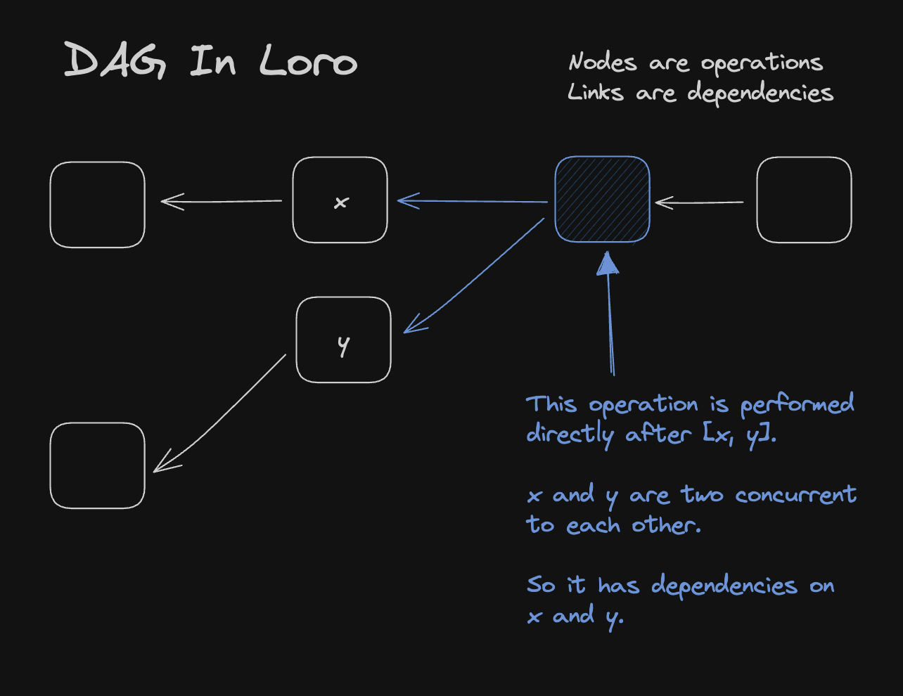
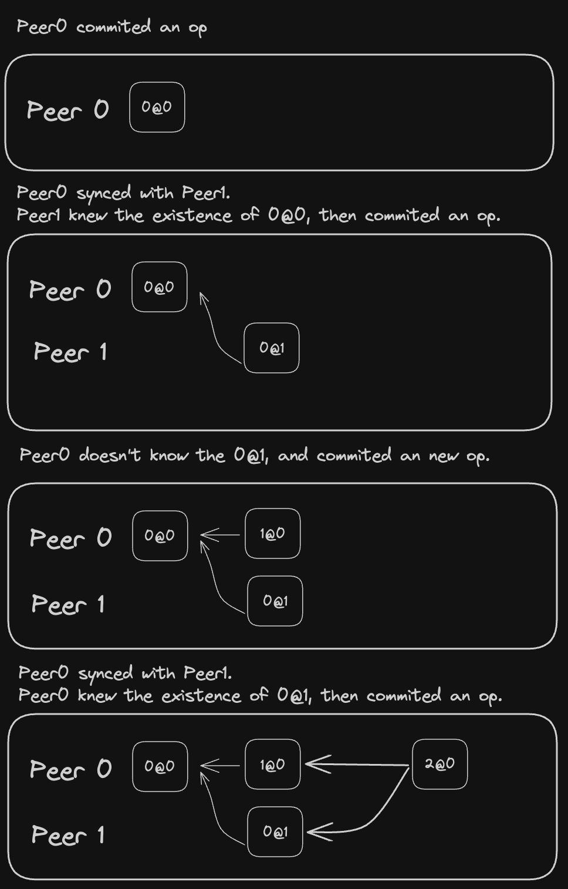
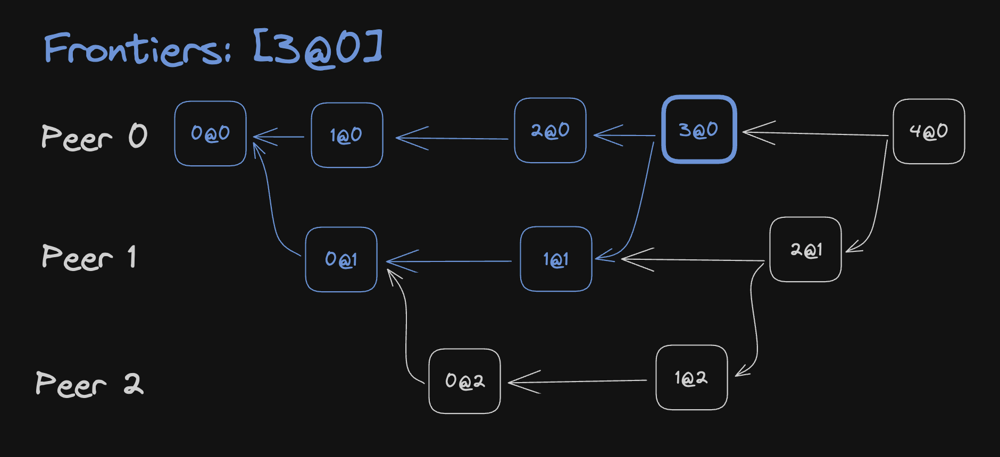
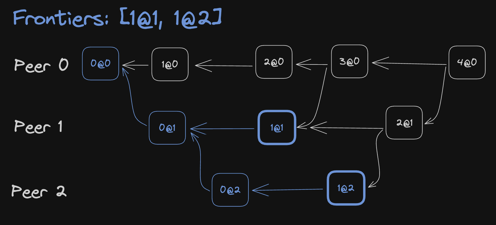

# Loro 版本系统深度解析：DAG、前沿与版本向量

在中心化环境中，我们通常用线性递增的数字或时间戳来表示版本。然而 CRDT 面向的是去中心化场景，版本的表达方式也随之改变。

在 Loro 中，可以通过[版本向量（Version Vector）](https://en.wikipedia.org/wiki/Version_vector)或前沿（Frontiers）来描述文档版本。

```ts twoslash
import { LoroDoc } from "loro-crdt";
const doc = new LoroDoc();
// ---cut---
doc.version();        // State Version vector
doc.oplogVersion();   // OpLog Version vector
doc.frontiers();      // State Frontiers
doc.oplogFrontiers(); // OpLog Frontiers
```

大多数情况下，版本向量已经足以满足同步与比较版本的需求。

前沿比版本向量更节省空间，但也带来更多限制。

接下来我们会逐一介绍这两种版本描述方式。

## 背景知识

Loro 属于基于操作的 CRDT。只要两个 Loro 文档包含的已生效操作集合相同，它们就是一致的。版本就是用于紧凑描述“这个集合里有哪些操作”的方法。

每个操作都会拥有一个唯一的 ID，称为 OpId。比如，每次用户删除或插入字符都会生成独一无二的 OpId（无需担心体积，我们在内存和编码阶段做了压缩）。OpId 由 PeerId 与 Counter 组成。

> 💡 提示：为了讲解方便，下文会简化具体的类型定义（例如 peer 的类型），不影响对概念的理解。

```ts
interface OpId {
  // Simplified here
  // PeerId is actually close to uuid type, Loro uses u64
  peerId: number;
  counter: number;
}
```

PeerId 表示操作该文档的设备 ID；Counter 是该设备上从 0 开始递增的数字。

## 版本向量

版本向量是一个向量，描述每个 Peer 从 0 开始需要包含多少个操作。

```ts
// In TypeScript
type VersionVector = { [peerId in number]: number };
```

以版本向量 A 为例：

```tsx
const A = {
  0: 2,
  1: 3,
};
```

它包含：

- PeerId == 0 且 Counter < 2 的所有操作
- 或 PeerId == 1 且 Counter < 3 的所有操作

这种表达方式让我们可以轻松比较两个版本，找出彼此缺失的操作。例如假设服务器上的文档已经到达版本 B，而用户设备仍停留在版本 A。为了让用户设备补齐缺失的操作：

```tsx
const A = {
  0: 2,
  1: 3,
};

const B = {
  0: 5,
  1: 3,
  2: 9,
};
```

我们就能算出设备缺失的操作：

- PeerId == 0 且 2 ≤ Counter < 5 的所有操作
- 或 PeerId == 2 且 Counter < 9 的所有操作

版本向量不仅能标识版本，还能快速计算两个版本之间的差异（也就是待同步的操作集合）。在 Loro 中，可以用下面的方法同步两个文档，只导入对方缺失的操作：

```ts twoslash
import { LoroDoc } from "loro-crdt";
const a = new LoroDoc();
const b = new LoroDoc();
// ---cut---
// doc.version() returns the version vector of the doc
a.import(b.export({ mode: "update", from: a.version() }));
b.import(a.export({ mode: "update", from: b.version() }));
```

## 有向无环图（DAG）历史

Loro 还会记录一份类似 Git 的有向无环图（DAG）操作历史。我们在每个操作上记录依赖关系（Dependencies）来表示 DAG。只要操作集合一致，所有端上的 DAG 就保持一致。



当有新操作写入时，它的依赖指向当前未被指向的操作。

> 💡 提示：操作之间只存在偏序关系，可能彼此前后，也可能并行。DAG 的结构让我们能够紧凑地表达这种偏序。

DAG 历史既能帮助我们设计特殊的 CRDT 算法，也支持时间旅行能力；当自动合并效果不理想时，DAG 还能帮助用户手动化解潜在冲突。

> 💡 我们会用 `Counter@PeerId` 的记法来更紧凑地描述 OpId。

下面是 DAG 形成的示意：



## 前沿（Frontiers）

版本向量的大小会随 Peer 数量增加而膨胀。为了避免 PeerId 冲突，多数 CRDT 库在每次打开文档时都会生成新的随机 PeerId，这进一步抬高了版本向量的开销。

> 📌 如果 PeerId 重复，就很可能出现重复的 OpId，从而导致 CRDT 文档不一致。Automerge 通过增加同步复杂度解决了这个问题，让文档即便出现重复 OpId 也能保持一致。

基于 DAG 信息，我们可以用更紧凑的方式描述版本：给定一个或多个 OpId，包含所有因果顺序小于等于它们的操作。这种方式称为前沿（Frontiers）。

```ts twoslash
import { OpId } from "loro-crdt";
// ---cut---
type Frontiers = OpId[];
```

> 💡 同样使用 `Counter@PeerId` 来表达 OpId。



在上图中，`Frontiers = [3@0]` 覆盖 6 个操作：

- PeerId == 0 且 Counter < 4
- PeerId == 1 且 Counter < 2

它等价于以下版本向量：

```tsx
{
    0: 4,
    1: 2,
}
```

前沿也可以描述多条并行的操作：



在这个例子中，`Frontiers = [1@1, 1@2]` 对应的版本向量是：

```tsx
{
    0: 1,
    1: 2,
    2: 2,
}
```

前沿的一个重要特性是：`Frontiers = [A]` 其实就表示执行完操作 A 后的文档版本。因此结合 Loro 的时间机器能力，可以轻松回到任意特定操作对应的版本。以下示例演示了整个过程：

```ts twoslash
import { LoroDoc } from "loro-crdt";
import { expect } from "expect";
// ---cut---
const doc = new LoroDoc();
doc.setPeerId(0n);
const text = doc.getText("text");
text.insert(0, "H");
doc.commit();
const v = doc.frontiers();
text.insert(1, "i");
expect(doc.toJSON()).toStrictEqual({
  text: "Hi",
});

doc.checkout([{ peer: "0", counter: 0 }]);
expect(doc.toJSON()).toStrictEqual({
  text: "H",
});
```

只要目标版本仍在文档历史中，Loro 就支持在版本向量与前沿之间互转：

```ts twoslash
import { LoroDoc } from "loro-crdt";
const doc = new LoroDoc();
// ---cut---
const f = doc.frontiers();
const vv = doc.frontiersToVV(f);
// vv equals to doc.version()
const frontiers = doc.vvToFrontiers(vv);
```
