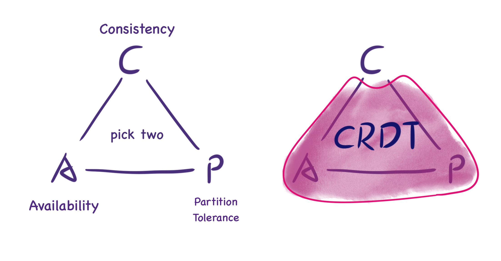

import Image from "next/image";

# 什么是 CRDT？

CRDT（Conflict-free Replicated Data Type，冲突自由复制数据类型）是一种可以在网络中复制到多台计算机上的数据结构，各个副本能够独立并行更新，无需副本之间协调，同时保证不会出现冲突。

CRDT 常用于协作类软件，例如多名用户需要共同编辑或阅读的共享文档、数据库或状态。它同样可以应用于数据库软件、文本编辑器、聊天工具等场景。

# CRDT 解决了什么问题？

以多人同时在线编辑同一份文档为例。

这一场景要求每位用户即便在不同用户并发修改（例如两个人同时修改标题）之后，也能看到相同的内容，这被称为**一致性**。（严格来说，CRDT 满足的是最终一致性，详见下文。）

即使用户离线，也能继续使用 CRDT；当网络恢复时，副本可以重新同步。它还支持通过 P2P 与其他用户协同编辑，这体现为**分区容错性**。因此 CRDT 非常适合构建**去中心化**应用：即便没有中心化服务器也能完成同步。

# CRDT 的出现

Marc Shapiro 在 2011 年的论文《[Conflict-Free Replicated Data Types](https://inria.hal.science/hal-00932836/file/CRDTs_SSS-2011.pdf)》中首次提出 CRDT（Conflict-free Replicated Data Types，冲突自由复制数据类型）的正式概念。不过可以认为更早之前就已经奠定了基础，例如 2006 年的研究《[Woot](https://doi.org/10.1145%2F1180875.1180916): An Algorithm for Collaborative Real-time Editing》。开发 CRDT 的主要动机，是为了解决在最终一致性模型下设计冲突解决机制的难题。CRDT 推出之前，相关文献给出的指导非常有限，临时拼凑的方案也容易出错。因此 Shapiro 的论文提供了一种简单且理论完备的方法，利用 CRDT 来实现最终一致性。

（注：Marc Shapiro 在 2007 年曾发表论文《[Designing a commutative replicated data type](https://hal.inria.fr/inria-00177693v2/document)》。2011 年他将 commutative 改写为 conflict-free，并将该定义扩展到了状态型 CRDT。）

根据 [CAP 定理](https://en.wikipedia.org/wiki/CAP_theorem)，分布式系统不可能同时完美满足以下三个条件。

- _一致性（Consistency）_：每次读取要么返回最近一次写入的结果，要么返回错误；系统表现得像在访问同一份数据。
- _可用性（Availability）_：每个请求都会得到非错误响应，但不保证返回的是最新的数据。
- _分区容错性（Partition tolerance）_：即使系统不同组件之间的通信丢失或延迟导致网络分区，整个分布式系统仍能正常工作。

如果系统在限定时间内无法达成数据一致，就意味着出现了分区，只能在当前操作中在 C 与 A 之间做出选择，因此“完美一致性”会和“完美可用性”发生冲突。

CRDT 并不追求“完美一致性”，而是提供强最终一致性（Strong Eventual Consistency，简称 SEC）。这意味着站点 A 可能不会立即反映站点 B 的状态变化，但当 A 和 B 同步消息后，就能重新达成一致，并且无需再处理潜在冲突（CRDT 在数学上杜绝了冲突）。_强最终一致性_ 与 _可用性_ 以及 _分区容错性_ 并不矛盾，CRDT 在 CAP 上给出了一个良好的折中。

_CRDT 满足 A + P + Eventual Consistency，是 CAP 下的优雅折衷_

（注：CAP 定理作者 Eric Brewer 在 2012 年撰写了《[CAP Twelve Years Later: How the "Rules" Have Changed](https://www.infoq.com/articles/cap-twelve-years-later-how-the-rules-have-changed/)》，指出“CAP 三选二”的说法其实容易误导。CAP 真正排除的只是极小设计空间内“完美可用性 + 完美一致性”的组合，即在存在分区时；实际上，针对 C 与 A 的权衡仍有很大自由度。CRDT 就是很好的例子。）

# 一个简单的 CRDT 示例

我们可以通过几个简单的例子了解 CRDT 如何实现**强最终一致性**。

> **只增计数器（Grow-only Counter）**

如何在分布式系统中统计事件发生次数，同时避免加锁？

<Image src="/crdt-G-Counter.gif" alt="G-Counter 动画" width="400" height="400" />

- 让每个副本只递增自己的计数值 => 无需加锁同步，也不会产生冲突。
- 每个副本同时保存其他副本的计数值。
- 事件发生次数 = 所有副本计数值之和。
- 副本只更新自身计数，不会与其他计数发生冲突，因此消息同步后即可保持一致。

> **只增集合（Grow-only Set）**

<Image src="/crdt-G-Set.gif" alt="G-Set 动画" width="400" height="400" />

- 只增集合中的元素只能增加，不能删除。
- 合并两个状态时，只需计算集合并集。
- 因为只有增加操作，不会发生冲突，消息同步后即可保持一致。

这两种结构都是 CRDT，它们具备以下共同特性：

- 副本之间可以独立并发更新，无需协调（加锁）。
- 多次更新不存在冲突的可能。
- 最终总能保证一致性。

# 原理简介

CRDT 分为基于操作（Op-based）和基于状态（State-based）两类，本文聚焦于基于操作的 CRDT。

操作型 CRDT 的原则是：如果两个用户执行完全相同的操作序列，文档的最终状态也必须完全一致。为此，每个用户都会保存自己对数据执行的所有操作（Operation），并将这些操作与其他用户同步，从而确保最终状态一致。该方法的关键挑战是保证操作顺序一致，尤其是在并行修改发生时。为了解决这一问题，操作型 CRDT 要求所有可能并行的操作都可交换，以满足最终一致性的要求。

# CRDT 与 OT 的对比

CRDT 与 [Operation Transformation（OT）][ot] 都可以应用在在线协作场景，两者之间的差异如下：

| OT                                                                                                                                                                                                   | CRDT                                                                                  |
| :--------------------------------------------------------------------------------------------------------------------------------------------------------------------------------------------------- | :------------------------------------------------------------------------------------ |
| OT 依赖中心化服务器协作；[在分布式环境下很难实现](https://digitalfreepen.com/2018/01/04/operational-transform-hard.html)                                                                             | CRDT 可以通过 P2P 等方式同步数据，天然支持分布式                                                                            |
| 最早的 OT 论文发表于 1989 年                                                                                                                                                                         | 最早的 CRDT 论文发表于 2006 年                                                        |
| OT 算法为了保证一致性，设计更复杂                                                                                                                                                                    | CRDT 算法设计更简单即可保证一致性                                                     |
| 更容易设计出能保留用户意图的 OT                                                                                                                                                                      | 设计同时保留用户意图的 CRDT 算法更困难                                                 |
| OT 不会影响文档体积                                                                                                                                                                                 | CRDT 文档比原始数据更大                                                                |

[a highly-available move operation for replicated trees]:
  https://martin.kleppmann.com/papers/move-op.pdf
[moving elements in list crdts]:
  https://martin.kleppmann.com/papers/list-move-papoc20.pdf
[interleaving anomalies in collaborative text editors]:
  https://martin.kleppmann.com/papers/interleaving-papoc19.pdf
[conflict-free replicated data types]: https://readpaper.com/paper/1516319412
[5000x faster crdts: an adventure in optimization]:
  https://josephg.com/blog/crdts-go-brrr/
[json crdt]: https://arxiv.org/abs/1608.03960
[yata]:
  https://www.researchgate.net/publication/310212186_Near_Real-Time_Peer-to-Peer_Shared_Editing_on_Extensible_Data_Types
[yjs]: https://github.com/yjs/yjs
[loro]: https://loro.dev
[automerge]: https://github.com/automerge/automerge
[half grid]: https://zh.wikipedia.org/wiki/%E5%8D%8A%E6%A0%BC
[ot]: https://en.wikipedia.org/wiki/Operational_transformation
[crdts and the quest for distributed consistency]:
  https://www.infoq.com/presentations/crdt-distributed-consistency/
