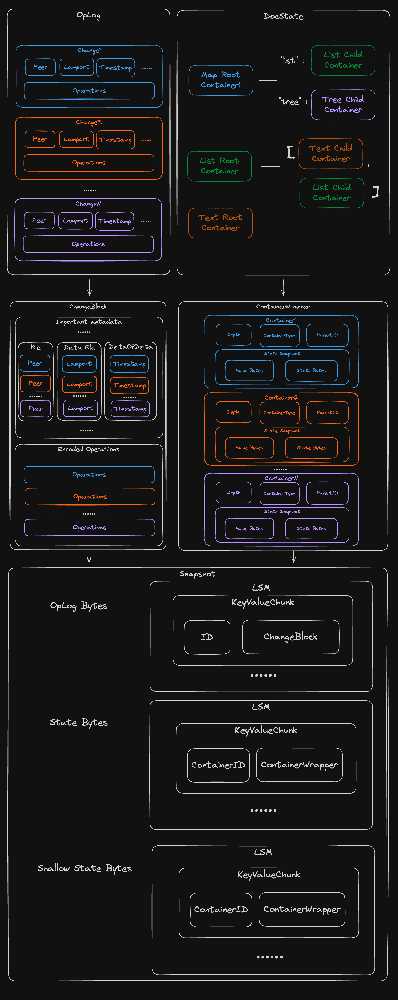

# 导出模式

> Loro 1.0 的数据格式已稳定，不会再发生破坏性变更。

Loro 提供三种编码模式，以适配不同场景：

- **Updates 编码**：编码全部或指定区间的操作，适合增量同步。
- **Snapshot 编码**：编码完整文档，包含全部操作与当前状态。
- **Shallow Snapshot 编码**：Loro 1.0 新增的模式，可丢弃无用历史，只保留最近历史与当前状态。

使用统一的 `doc.export(mode)` 导出，所有二进制格式都可以通过 `doc.import(bytes)` 导入。

```ts no_run
export type ExportMode =
  | {
      mode: "update";
      from?: VersionVector;
    }
  | {
      mode: "updates-in-range";
      spans: {
        id: ID;
        len: number;
      }[];
    }
  | {
      mode: "snapshot";
    }
  | {
      mode: "shallow-snapshot";
      frontiers: Frontiers;
    };
```

## Updates 编码

包含 `update` 与 `updates-in-range` 两种子模式：

- `update`：从指定版本 `from` 到最新版本的所有操作
- `updates-in-range`：编码指定版本区间内的操作

```ts twoslash
import { LoroDoc } from "loro-crdt";
// ---cut---
const doc1 = new LoroDoc();
const doc2 = new LoroDoc();
doc2.setPeerId(2);

doc2.getText("text").insert(0, "hello");
const bytes = doc2.export({ mode: "update", from: doc1.version() });
// const bytes = doc2.export({ mode: "updates-in-range", spans: [{ id: { peer: 2, counter: 0 }, len: 1 }] });
doc1.import(bytes);
console.log(doc1.toJSON()); // { text: "hello" }
```

与其导出整个文档，不如只导出增量操作，更适合实时协作。

## Snapshot 编码

```ts twoslash
import { LoroDoc } from "loro-crdt";
// ---cut---
const doc1 = new LoroDoc();
const doc2 = new LoroDoc();

doc2.getText("text").insert(0, "hello");
const bytes = doc2.export({ mode: "snapshot" });
doc1.import(bytes);
console.log(doc1.toJSON()); // { text: "hello" }
```

Snapshot 编码会打包当前状态与全部历史，适合快速恢复完整文档。

## Shallow Snapshot 编码

为了支持冲突解决与回溯，Loro 默认保留全部历史；但在多数场景中，旧历史既无用又占空间。Shallow Snapshot 允许你指定历史起点，截断更早的记录。

```ts twoslash
import { LoroDoc } from "loro-crdt";
// ---cut---
const doc1 = new LoroDoc();
const doc2 = new LoroDoc();
doc2.setPeerId(2);

const text = doc2.getText("text");
text.insert(0, "hello");
const frontiers = doc2.frontiers();
text.insert(0, "w");
text.insert(0, "o");
text.insert(0, "r");
text.insert(0, "l");
text.insert(0, "d");
const bytes = doc2.export({ mode: "shallow-snapshot", frontiers });
doc1.import(bytes);
console.log(doc1.toJSON()); // { text: "hello" }
```

注意：使用浅快照后，不能再导入与起始版本并发的更新。详情见[浅快照](/docs/advanced/shallow_snapshot)。

## Snapshot 文件格式

为支持惰性加载，Loro 借鉴数据库通用格式，引入简单的 LSM 引擎，将编码结果抽象为 key/value 形式，方便未来与常用 KV 数据库集成。

### 编码细节

- 连续属于同一容器的多个操作会合并成一个 Change，每个 Change 包含 ID、Lamport、Timestamp 等元数据
- 多个连续的 Change 会组合成 ChangeBlock，作为最小的历史编码单元
- ChangeBlock 以首个 Change ID 作为 key，可快速查询对应操作
- 文档状态由各容器状态组成：key 为 ContainerID，value 为容器元数据 + 语义化编码数据
- 所有 key-value 会存入简化的 LSM 结构

最终导出包含四部分：编码头、oplog 字节、最新状态字节、浅状态字节。

- Header：4 字节 magic number + 16 字节校验和 + 2 字节编码模式
- 其余部分均使用 [LSM 编码结构](https://github.com/loro-dev/loro/blob/main/crates/kv-store/src/lib.rs)

## Snapshot 编码布局


